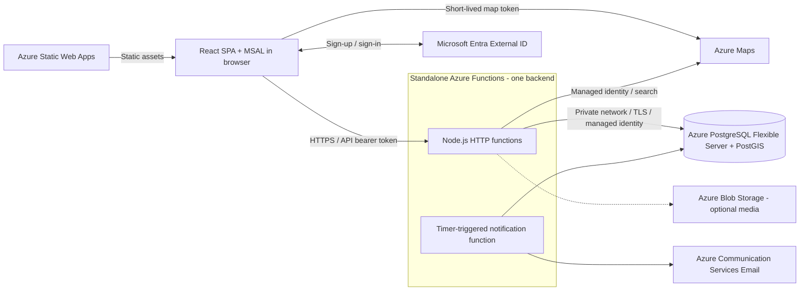
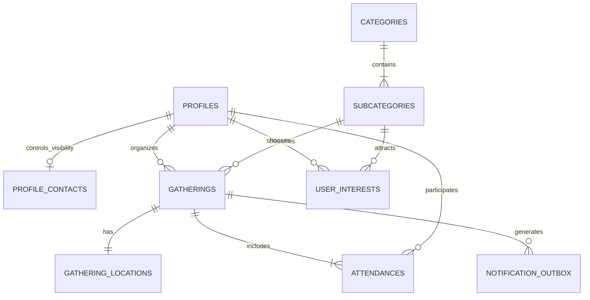

# Gather: Azure-first product plan and architecture

> Find your people. Do more together.

**Status:** Architecture and implementation plan only. "Gather" is a working name. The existing React project is a scaffold, not an implementation of the features below. No Azure resources have been provisioned.

## 1. Product scope

The core loop is:

**Register -> choose a fixed category/subcategory -> find or host a gathering -> meet in real life.**

The MVP supports:

- Registration, login, email verification, account recovery, and a profile with name, gender, age, email, and an optional phone number.
- Browsing a fixed category catalog such as `Sports > Football`; users cannot create categories.
- Selecting `Sports > Other` and describing the activity later in the gathering-creation flow.
- Hosting a gathering that starts now or at a future date and time.
- Choosing a meeting location using address search and a map pin.
- Searching by category, location, or both, with time and availability filters.
- Viewing gathering details, joining or requesting to join, and leaving.
- Managing hosted gatherings, attendance requests, and upcoming plans.
- Essential cancellation/update notifications and reporting/moderation.

Recommended initial product defaults are free gatherings, one fixed subcategory per gathering, two category levels, a responsive web client, and one launch region. Browsing gatherings does not require an account; publishing and joining require a verified account and completed profile. Member profile details require a signed-in, eligible viewer.

Do not build a separate community/group product first. A category organizes interests; a gathering is the actual plan people join.

## 2. Azure-first stack and deployment

Use a **React SPA on Azure Static Web Apps and native Node.js/TypeScript HTTP functions on Azure Functions Flex Consumption**. This MVP needs backend code, but it does not need a separately operated Express server.

Keep the HTTP functions and notification timer in one standalone Function App initially, with shared application services and repositories. This is one backend codebase, not a separately deployed microservice for every route.

If a persistent Node.js server becomes necessary, use **Express on Azure App Service**. That is the server alternative, not an additional component of the serverless architecture.

| Layer | Recommendation | Reason |
| --- | --- | --- |
| Client | React, TypeScript, Vite; one SPA | Keep the client small without introducing routing or rendering frameworks by default. |
| Styling | CSS Modules and a small global stylesheet | Component-scoped styles, shared CSS variables, and responsive CSS. **No Tailwind CSS.** |
| Navigation | React state initially; React Router only when necessary | Panels, dialogs, categories, and filters do not inherently require a router. |
| Client state | `useState` / `useReducer` initially; Zustand only if a shared store becomes necessary | Avoid a global store until multiple independent components genuinely need shared client-owned state. |
| Server data | A thin typed `fetch` layer initially | Add TanStack Query only if repeated caching, refetching, and invalidation requirements justify it; it is not a prerequisite. |
| Forms and contracts | React forms and shared Zod schemas | Validate authoritatively on the server. Add React Hook Form only if form complexity warrants it. |
| Frontend hosting | Azure Static Web Apps, serving the Vite build | Static hosting for the SPA without a Node.js process serving frontend files. |
| HTTP API and hosting | Azure Functions Flex Consumption; Node.js/TypeScript with the v4 programming model | Native HTTP handlers, managed scaling, and VNet connectivity; no Express adapter or `app.listen()` required. |
| Customer authentication | Microsoft Entra External ID with MSAL React | Hosted customer signup/sign-in; the SPA obtains an access token for the Functions API. |
| Database | Azure Database for PostgreSQL Flexible Server with PostGIS | Relational integrity, transactions, category trees, and indexed geographic search on Azure. |
| Data access | `pg`, typed repositories, versioned SQL migrations | Explicit transactions and full access to PostGIS without ORM-specific spatial limitations. |
| Maps | Azure Maps Web SDK and Azure Maps Search APIs | Map display, address/POI lookup, pin selection, and reverse geocoding. |
| Background processing | Timer-triggered Azure Function plus a database outbox | Durable notifications outside HTTP requests; added to the backend when participation notifications are introduced. |
| Email | Azure Communication Services Email | Application confirmations, reminders, and change/cancellation messages; authentication emails remain with External ID. |
| Media | Azure Blob Storage with private containers | Optional avatars and gathering covers, not a function instance's local filesystem. |
| Service identity and secrets | Managed identities; Azure Key Vault for any remaining secrets | Passwordless resource access where supported; no client secret belongs in the SPA. |
| Observability | Azure Monitor and Application Insights | Centralized errors, request traces, dependency latency, and operational alerts. |
| Infrastructure and delivery | Bicep and Azure DevOps Pipelines | Azure resource definitions and repeatable deployment using federated service connections. |

Use Static Web Apps for static hosting only, not its managed API functions. Managed APIs are HTTP-only and lack managed identity support; the standalone Function App supplies the networking, service identity, and timer capabilities needed here.

The SPA calls the standalone API's HTTPS origin directly with explicit CORS configuration. This avoids depending on Static Web Apps' linked-backend hosting-plan compatibility. There is no API proxy or gateway in the baseline.

Keep Functions and PostgreSQL in the same Azure region where possible. Use Flex Consumption VNet integration to reach the private database; the HTTP API remains publicly reachable with application-level authorization. Enable always-ready instances if interactive latency warrants them, and bound scale-out to the database's connection budget.

### Does the MVP need an Express server?

No current feature requires one:

| Requirement | Serverless implementation |
| --- | --- |
| Signup and login | Entra External ID and MSAL; credentials are not handled by an Express server. |
| Fixed categories and profile/gathering CRUD | Short HTTP functions calling shared services and PostgreSQL. |
| Joining without overbooking | A PostgreSQL transaction held on one connection within the function invocation. |
| Category and nearby search | Parameterized SQL/PostGIS queries from an HTTP function. |
| Reminders and cancellation messages | Timer-triggered processing of a durable database outbox. |
| Optional uploads | Authorized Blob Storage access rather than local files. |

The tradeoffs are cold starts, two deployment artifacts (SPA and backend), token-based client authentication, and careful database connection management. None requires an Express process. Serverless does not remove the backend or make PostgreSQL serverless.

Choose Express on App Service only if a concrete requirement needs long-lived server behavior, an essential middleware integration is unsuitable for native functions, or operating one persistent application is deliberately preferred. Keep domain services independent of HTTP handlers so that switch is possible without rewriting business rules. Do not add Express inside a function just to recreate a server.

### Client simplicity rules

A SPA does not require React Router. Start with a small number of views and dialogs driven by local React state. A link such as `/?gathering=<id>` can open a gathering on initial load without a routing framework.

Introduce React Router only when independently addressable screens, nested navigation, or reliable browser back/forward behavior make it useful. It would still be a SPA. Do not build a complicated custom router to avoid a small routing dependency.

Keep form fields, dialog visibility, and temporary filters local. If state genuinely needs to be shared across otherwise independent features, use **Zustand**, not a second state-management framework. Do not copy API entities into Zustand merely to create a global store, and never put authentication tokens there.

Use CSS Modules alongside global design tokens, typography, and resets. There is no Tailwind setup, utility-class framework, or CSS-in-JS requirement.

### High-level architecture



Static Web Apps serves the frontend. The API origin exposes `/api/v1/*` through HTTP functions. Customer sign-in redirects to External ID, and the client attaches an API access token only to API calls that need identity. Map rendering uses a separate, narrowly authorized Azure Maps token. The client never connects to PostgreSQL directly.

Managed identity, any required Key Vault references, Azure Monitor, and Application Insights support the Function App. The Functions runtime also needs an Azure Storage account for host coordination and deployment, even when user-uploaded media is disabled.

### Why this shape

PostgreSQL handles both relationships and location queries, so the MVP does not need Azure AI Search, a separate geo database, a cache, or a message broker. A modular application keeps transactions and deployment simple while preserving boundaries for later growth.

Azure Front Door, API Management, Service Bus, Managed Redis, and AKS are not baseline dependencies. Introduce a service only for a concrete capability or measured operational need.

## 3. Main user experiences

| Screen | Responsibilities |
| --- | --- |
| Discover | Category navigation, location/radius selection, happening-now/upcoming filters, synchronized list and map. |
| Category view | Fixed parent categories/subcategories and their relevant gatherings; no category-creation controls. |
| Registration/login | Hosted External ID signup/sign-in, verification, recovery, and return to the user's original action. |
| Profile/onboarding | Name, gender, age, required email, optional phone, and separate email/phone visibility controls. Device location remains optional. |
| Member profile | Name, gender, age, and only the contact fields the owner explicitly chose to share. |
| Create gathering | Fixed subcategory, title, description, conditional Other details, now/later, time/duration, location, capacity, and joining policy. |
| Gathering detail | Host, category, schedule, capacity, appropriately visible location, attendee state, and join/leave actions. |
| My plans | Going, hosting, pending requests, and past/cancelled plans. |
| Host management | Edit or cancel a gathering and approve or decline requests. |
| Moderation | Report queue, gathering removal, and account suspension; no user-generated taxonomy to clean up. |

These are product views, not a requirement for one URL route per screen. They can initially be panels or dialogs within the SPA.

The list must remain usable when a map fails to load. Denying browser geolocation must not prevent discovery: users can search a city/address or move the search center themselves.

## 4. Domain rules

### Registration and authorization

Microsoft Entra External ID in an external tenant owns customer credentials, signup, verification, and recovery. The application owns profiles, permissions, and participation. Customers do not need to be employees or members of the Azure subscription's workforce tenant.

Register the SPA and API separately in External ID, configure the signup/sign-in user flow, and expose a delegated API scope. MSAL React uses authorization-code flow with PKCE to obtain access tokens. The SPA is a public client and has no client secret.

This replaces the earlier App Service cookie-based design. Static Web Apps built-in authentication and App Service Easy Auth are not additional identity layers in this architecture. Use MSAL's supported cache/renewal behavior, prefer session-scoped storage, and do not copy tokens into Zustand or custom persistent stores.

The SPA sends its API access token using the Bearer scheme in the Authorization header. Shared authentication code verifies signature and allowed algorithms, the expected External ID issuer, API audience, expiry/not-before, and the required delegated scope. Use a maintained JWT library such as `jose` with keys from the configured issuer's discovery/JWKS metadata, including key rotation. Do not accept an ID token, a token for another API, or arbitrary decoded claims as authorization.

Map the validated issuer and subject to an internal application user ID. Never derive the actor from submitted `userId` fields, caller-supplied principal headers, or email matching. Configure verified signup explicitly and initialize the application profile through the authenticated onboarding endpoint.

Allow anonymous catalog and gathering discovery, but require authentication for member profiles and protected actions. Missing/invalid credentials produce JSON `401`; insufficient permission produces `403`. Enforce profile completion, verification, suspension, blocking, and resource ownership independently of token validity.

Function keys are not user authentication and must not be shipped to the SPA. HTTP triggers can use function-key level `anonymous` while the application enforces bearer-token authorization on protected routes. Configure narrow CORS rules, including preflight handling; CORS does not replace authorization.

Clear account-specific application data and the SDK session on logout/account switching. The API does not accept an ambient session cookie for authorization. If an Express alternative later introduces cookie-based authentication, add the corresponding CSRF defenses rather than silently supporting both modes.

Any verified, unsuspended user with a completed profile can host. Only the organizer can modify a gathering, cancel it, or approve attendance. Moderation privileges are assigned server-side and sensitive actions are audited.

### Profile fields and visibility

| Field | Collection | Visibility to other users |
| --- | --- | --- |
| Name | Required; a chosen display name, not necessarily a legal name | Visible on member profiles and as the gathering host name. |
| Gender | Required selection, including self-description or "Prefer not to say" | The chosen response is visible on member profiles. Do not infer it from other information. |
| Age | Required, self-reported age with a confirmation timestamp | Visible on member profiles; it is not presented as verified identity data. |
| Email | Required and verified through the identity/contact flow | Hidden by default; shown only when the owner explicitly enables email sharing. |
| Phone number | Optional; validate and normalize its format | Hidden by default; shown only when the owner explicitly enables phone sharing. |

For the MVP, "other users" means signed-in, eligible, non-blocked members. Anonymous gathering discovery may show the host's chosen name, but not gender, age, email, or phone. Do not add demographic search filters just because these fields exist.

Collect age rather than an unrequested full date of birth in the MVP. Store when the age was confirmed, let the user update it, and prompt for periodic reconfirmation; do not automatically increment age without knowing a birthday. Enforce the launch age policy without labeling self-reported age as verified. The minimum launch age and restrictions for Bar Crawl must be settled before public launch.

Onboarding explains that name, gender, and age are visible to members and shows a profile preview. Gender can explicitly be "Prefer not to say"; the user does not have to disclose a specific gender to complete the required selection.

Provide **independent, off-by-default controls**: `share_email` and `share_phone`. Entering a contact value, joining a gathering, or enabling email notifications does not authorize sharing it. These are member-wide sharing choices in the MVP, not per-recipient approvals.

Keep contact values in a private table. The member-profile API includes each contact field only if its corresponding consent flag is true and the viewer is eligible. Apply this server-side, not by returning all fields and hiding them in React. The owner can always see their own contacts through `/me`.

Do not embed email or phone in gathering search responses, attendee lists, public pages, analytics, or logs, even when profile sharing is enabled. Only the authorized member-profile view can disclose them.

Changing a contact value resets that field's sharing flag until the owner explicitly approves the new value. Clearing a phone also disables phone sharing. Email replacement must follow a verified change flow, not an unrestricted profile patch. A formatted phone number is not automatically a verified phone number; SMS verification is not an MVP prerequisite.

Allow consent withdrawal at any time. Apply it to subsequent API reads and invalidate application-controlled profile caches; data already viewed or copied cannot be recalled. Use non-cacheable authenticated profile responses so a shared CDN cache cannot leak contacts or preserve revoked visibility.

### Fixed categories and Other

The MVP catalog is exactly **3 parent categories and 12 subcategories**:

| Category | Fixed subcategories |
| --- | --- |
| Sports | Basketball, Football, Volleyball, Ping-pong, Tennis, Padel, Other |
| Gaming | PC, Console, Boardgames |
| Social | Bar Crawl, Gathering |

There is no category creation, renaming, merging, or reparenting UI/API for users. Maintain the fixed catalog through reviewed seed migrations with stable identifiers and display ordering. The runtime database role has read-only access to category tables.

A host must choose one subcategory, not just a parent. Parent categories are useful for browsing all their subcategories. The supplied catalog includes **Other only under Sports**; do not silently add it to Gaming or Social.

When a host selects `Sports > Other`, collect a required, nonblank `other_description` later in the gathering-creation form: "Describe the activity." It belongs to that gathering and does not create a new category. Browsing or selecting interests does not require this description.

Mark that subcategory as `requires_description` in the read-only catalog. Validate the condition on both creation and subcategory changes. Clear `other_description` when switching to a regular subcategory so stale hidden text is not retained. The general gathering description remains a separate field.

### Instant and scheduled gatherings

Use the same entity and creation flow for both:

| Choice | Behavior |
| --- | --- |
| Start now | The server assigns `starts_at` from its own clock; the host supplies a duration or end time. |
| Plan ahead | The host selects a local date/time, timezone, and duration or end time; the API validates the future instant. |

Every gathering has an end time. Store start/end instants as PostgreSQL `timestamptz` and also store the IANA timezone, such as `Europe/London`. A timestamp alone does not preserve the original timezone.

Resolve local date/time input explicitly. Reject nonexistent daylight-saving times and require an explicit choice of offset for ambiguous ones.

Persist lifecycle status as `published`, `cancelled`, or `removed`. Derive `upcoming`, `happening now`, and `ended` from server time and start/end timestamps. Derive `full` from confirmed attendance rather than maintaining an independent status.

An event planned in advance appears under "Happening now" when it starts. That filter is based on time, not on whether the host originally chose "Start now."

Cancelled, removed, and ended gatherings cannot accept new attendees. Ended gatherings remain in participants' history; a background expiration job is not required to hide them from active discovery.

### Attendance and capacity

Capacity means total confirmed people, **including the organizer**. Create the organizer's confirmed attendance in the same transaction as the gathering.

Public-venue gatherings can use instant joining. Private-address gatherings require host approval before revealing the exact location. Pending requests do not reserve capacity.

Attendance states are `pending`, `going`, `declined`, and `left`. Maintain one row per gathering/user. Repeated join or leave requests must be safe to retry.

All operations affecting capacity, eligibility, or cancellation serialize on the same gathering row:

1. Begin a database transaction and lock the gathering with `SELECT ... FOR UPDATE`.
2. Validate lifecycle, user eligibility, joining policy, and existing attendance.
3. For a confirmation, count confirmed attendees and reject if full.
4. Insert or update attendance, and write notification work in the same transaction.
5. Commit and return the authoritative attendance/capacity state.

Approval, joining, leaving, cancellation, and capacity changes follow this locking convention. Never implement joining as an unlocked "count then insert." Do not allow capacity to fall below confirmed attendance.

The organizer cannot simply leave their own gathering in the MVP; they must cancel it. Ownership transfer and waitlists are later features.

### Location visibility

Store two distinct concepts:

| Location | Who can see it |
| --- | --- |
| Public discovery location | Everyone eligible to discover the gathering. Exact for a public venue, approximate for a private address. |
| Exact meeting location and instructions | Public for an explicitly public venue; organizer and confirmed attendees only for a private address. |

For private locations, use an area-level label and a consistently generalized public point. Public map markers, distance values, sorting, and radius matching must all use that public point, not the hidden exact one. Otherwise repeated nearby searches could reveal a private address.

Explain that private-location distances are approximate. Do not expose exact locations in public descriptions, API payloads, shared caches, notification previews, analytics, or logs.

## 5. Data model

Use UUID identifiers, foreign keys, timestamps, and database constraints. Credentials remain with Entra External ID. Contact data is privately stored from onboarding; its storage location does not prevent explicitly authorized sharing through a filtered member-profile response.

| Table | Important fields |
| --- | --- |
| `profiles` | Internal UUID `id`, `auth_issuer`, `auth_subject`, `display_name`, `gender`, optional gender self-description, `age`, `age_confirmed_at`, optional bio/avatar, `timezone`, `status`, timestamps |
| `profile_contacts` | `user_id`, verified email, nullable phone, `share_email = false`, `share_phone = false`, per-field consent-change timestamps, notification preferences; privately stored from onboarding |
| `categories` | `id`, stable `key`, `name`, `sort_order`; 3 fixed parent rows |
| `subcategories` | `id`, `category_id`, stable `key`, `name`, `requires_description`, `sort_order`; 12 fixed child rows |
| `user_interests` | `user_id`, `subcategory_id`; composite primary key, if interest selection is included |
| `gatherings` | `id`, `organizer_id`, `subcategory_id`, `title`, `description`, nullable `other_description`, `creation_mode`, `starts_at`, `ends_at`, `timezone`, `capacity`, `status`, `join_policy`, `location_visibility`, `public_location`, `public_location_label`, `version` |
| `gathering_locations` | `gathering_id`, `exact_location`, host-authored address/venue/instructions, location source, and separately identified provider-derived fields with retention metadata where stored |
| `attendances` | `gathering_id`, `user_id`, `status`, timestamps; unique gathering/user pair |
| `notification_outbox` | `id`, `kind`, `gathering_id`, `gathering_version`, `recipient_id`, `scheduled_for`, `status`, `attempts`, `locked_until`, `dedup_key`, `last_error` |
| `reports` | Reporter, exactly one target gathering/user, reason, moderation status, timestamps |
| `user_blocks` | `blocker_id`, `blocked_id`; unique pair and no self-blocking |
| `idempotency_records` | Acting user, operation, request key, request hash, result/resource reference, expiry |

`gathering_locations` separates sensitive fields from the listing model; this separation is not a substitute for endpoint authorization.

Provision Azure Database for PostgreSQL Flexible Server with a supported PostgreSQL/PostGIS combination. Add `postgis` to the `azure.extensions` allowlist, then create the extension through a controlled database migration. Use the normal PostgreSQL database, not a separate location-search store.

### Relationships



### Important constraints and indexes

- `ends_at > starts_at`, positive bounded capacity, and valid enum/check values.
- Unique `(auth_issuer, auth_subject)` for mapping authenticated customers to internal users.
- Unique fixed catalog keys; foreign keys require every gathering to reference an existing subcategory.
- Required valid age/gender/name for a completed profile; email/phone sharing defaults to false and phone sharing cannot be enabled without a phone.
- Conditional nonblank `other_description` validation against the fixed subcategory metadata.
- Unique `(gathering_id, user_id)` for attendance.
- `geography(Point, 4326)` for location fields, with a GiST index on `gatherings.public_location`.
- An index beginning with `(subcategory_id, starts_at)` for published category discovery.
- An index on `(starts_at, id)` for upcoming ordering and pagination.
- An index on attendance `(user_id, status, gathering_id)` for My plans.
- An index on outbox `(status, scheduled_for)` and a unique notification deduplication key.

Use real query plans to refine indexes against representative data; do not add a second search system speculatively.

## 6. Category and location search

Category and location are independent, composable filters:

| Search | Meaning |
| --- | --- |
| Football | Eligible active gatherings assigned to `Sports > Football`. |
| Sports | Eligible active gatherings in any of the seven Sports subcategories, including Other. |
| Within 5 km | Eligible active gatherings within the selected radius. |
| Football within 5 km | The intersection of subcategory and location filters. |
| Happening now | `starts_at <= now` and `ends_at > now`, regardless of creation mode. |
| Upcoming | `starts_at > now`. |

The backend applies all filters before pagination. Never fetch a global page and then filter it in React.

The default active-discovery predicate is `status = 'published' AND ends_at > now()`. Requested time windows use interval overlap, so an event already underway can still match: `starts_at < window_end AND ends_at > window_start`.

The fixed two-level catalog needs only a join from `gatherings.subcategory_id` to `subcategories.category_id`, not recursive tree queries. Accept a parent `categoryId`, a `subcategoryId`, or both; if both are supplied, require the subcategory to belong to that parent. Reject unknown IDs and mismatched combinations instead of silently ignoring them.

An Other gathering remains in `Sports > Other`; its description does not create another searchable taxonomy node.

Nearby search is performed by PostGIS, not the maps provider:

```sql
ST_DWithin(
  gatherings.public_location,
  ST_SetSRID(ST_MakePoint(:longitude, :latitude), 4326)::geography,
  :radius_meters
)
```

This is illustrative SQL; execute it with bound parameters and the appropriate PostGIS schema qualification. Longitude comes before latitude. The geography overload uses meters.

Support soonest and nearest sorting. Nearest requires a search center. Use stable ordering with an ID tie-breaker and cursor pagination bound to the chosen filters and sorting. Start with 20 results per page and enforce a maximum.

Validate coordinates and require latitude/longitude together. Set a bounded radius, such as a 5 km default and 100 km maximum, as product configuration. Return `400` for invalid combinations rather than silently ignoring filters.

The map and list use the same search response. Cluster loaded markers and clearly distinguish a paginated subset from all matching gatherings. A separate aggregate marker endpoint is a later optimization if city-wide map browsing needs it.

Where sharing is useful, encode category/time filters and the selected gathering in simple query parameters; this does not by itself require React Router. Do not automatically persist precise device coordinates in browser history or share links. Keep device location in memory and redact coordinate query parameters from infrastructure logs.

## 7. Maps integration

Use the **Azure Maps Web SDK** (`azure-maps-control`) inside a small React component. Create/dispose the map through the component lifecycle; a separate React mapping framework is not required. Use Azure Maps Search for address lookup, supported POI/venue lookup, and reverse geocoding.

### Hosting flow

1. The host types an address or city, with debounced autocomplete and a minimum query length.
2. The host selects a result and confirms or adjusts the pin.
3. The host enters the venue name and meeting instructions, for example "North entrance, beside court 2."
4. The API validates coordinates and distinguishes host-authored meeting details from Azure Maps-derived data.
5. The API stores the location under the applicable retention rules and derives the appropriate public discovery location.

A browser-supplied place label is not proof that an event is genuinely at that place. Pin confirmation is required; host trust and reporting remain product concerns.

### Discovery flow

Use an optional browser location permission, a manually searched place, or a user-selected map center. The API applies category/radius/time filtering in PostGIS against the application's own gathering records. Azure Maps supplies the basemap and place/address lookup, not the gathering search engine.

Do not continuously track users or show a live map of people.

### Azure Maps authentication

Give the backend managed identity least-privileged Azure Maps data access scoped to this application's Maps account. Server-side address searches use that identity rather than a subscription key.

The Web SDK obtains an expiring Azure Maps token from a rate-limited endpoint on the Functions API origin. Use a maps-only identity/role for credentials made available to browsers, configure allowed browser origins, and return token responses with `Cache-Control: no-store`. Never ship the account's long-lived subscription key in the React bundle.

Discovery is public, so anonymous visitors can receive narrowly authorized map-rendering tokens. Treat those tokens as reusable by their holder until expiry; CORS is not an authorization boundary. Keep token permissions narrow and apply abuse limits. Customers' External ID accounts do not receive Azure resource RBAC roles.

### Provider content and retention

Follow the Azure Maps Product Terms applicable to the subscription. They permit storing geocodes while an Azure account remains active, but that is not blanket permission to retain every search result, POI record, map tile, or reverse-geocoded address indefinitely.

Store required coordinates and independently host-authored meeting details. Track provenance and expiry for any provider-derived labels or other content retained; refreshing or removing that content must not erase the host's own instructions. Host confirmation alone does not change the licensing of a provider-derived field.

For covered cached results, honor the shorter of the response-header validity and the stated retention limit in the applicable terms. Do not build a reusable POI database or cache provider results to bypass the service. Keep raw autocomplete responses out of permanent storage and logs.

Retain required Azure Maps/provider attribution, configure applicable region settings, and monitor request rates and throttling. Use supported API versions and verify address/POI coverage for the launch geography.

If geocoding fails, show an actionable retry state rather than inventing a coordinate or silently publishing an unresolved location.

## 8. API surface

Business endpoints run under `/api/v1` on the standalone Functions API origin. The SPA uses a configured API base URL; it must not assume `/api` is proxied by Static Web Apps. MSAL/External ID handle login and callbacks, not application `/.auth/*` endpoints.

Static hosting returns the SPA document for supported frontend entry URLs. Unknown API routes return JSON API errors, never frontend HTML. Native HTTP handlers share validation, authentication, authorization, and error mapping without an Express server.

| Method and route | Purpose |
| --- | --- |
| `GET /api/v1/me` | Current profile/account state, or onboarding-required state for an authenticated new customer. |
| `PUT /api/v1/me` | Idempotently initialize the application profile from the authenticated principal and validated onboarding input. |
| `PATCH /api/v1/me` | Update editable profile fields. |
| `GET /api/v1/users/:id` | Eligible-member profile view: name, gender, age, and only explicitly shared contacts. |
| `PATCH /api/v1/me/contact-visibility` | Independently enable/disable email and phone sharing; validate explicit booleans and contact availability. |
| `PATCH /api/v1/me/phone` | Set or remove an optional normalized phone; reset phone sharing after a change. |
| `PUT /api/v1/me/interests` | Replace selected fixed subcategory interests, if interest selection is included. |
| `PATCH /api/v1/me/notification-preferences` | Update notification preferences without accepting unverified replacement contact details. |
| `GET /api/v1/categories` | Return the complete read-only catalog with nested subcategories and Other-description metadata. |
| `GET /api/v1/gatherings` | Combined category, location, time, and availability search. |
| `POST /api/v1/gatherings` | Publish an instant or scheduled gathering; validate fixed subcategory/Other details and an idempotency key. |
| `GET /api/v1/gatherings/:id` | Details with caller-appropriate location visibility. |
| `PATCH /api/v1/gatherings/:id` | Organizer update, protected by an expected version. |
| `POST /api/v1/gatherings/:id/cancel` | Idempotent organizer cancellation. |
| `PUT /api/v1/gatherings/:id/attendance` | Join or request attendance; actor always comes from auth. |
| `DELETE /api/v1/gatherings/:id/attendance` | Withdraw a request or leave idempotently. |
| `GET /api/v1/gatherings/:id/requests` | Organizer-only pending attendance requests. |
| `PATCH /api/v1/gatherings/:id/requests/:userId` | Organizer approves or declines a pending request. |
| `GET /api/v1/me/gatherings?role=...&state=...` | Hosted, joined, pending, or historical gatherings. |
| `GET /api/v1/maps/token` | Expiring, narrowly authorized Azure Maps browser credentials; anonymous access with abuse limits. |
| `GET /api/v1/locations/search?q=...` | Rate-limited Azure Maps address/place suggestions. |
| `POST /api/v1/locations/resolve` | Confirm location data under the applicable storage policy. |
| `POST /api/v1/reports` | Report a gathering or user. |
| `PUT /api/v1/me/blocks/:userId` | Block a user. |
| `DELETE /api/v1/me/blocks/:userId` | Remove a block. |

Moderator endpoints are separate and role-protected. Add them for reviewing reports and hiding content, not as writable status fields on public endpoints.

No category or subcategory mutation endpoints are exposed. Email changes use a verified identity/contact-change flow, not the generic profile endpoint. Profile updates cannot set authentication identifiers, verification flags, or moderation roles.

Example combined search:

```http
GET /api/v1/gatherings?categoryId=<sports-id>&subcategoryId=<football-id>&lat=40.71&lng=-74.00&radiusMeters=5000&when=upcoming&sort=distance&limit=20
```

Use shared request/response schemas and generate an OpenAPI contract. Error responses have a stable code, safe message, optional field errors, and request ID. Distinguish unauthenticated, forbidden, invalid input, not found, full, stale update, and rate-limit outcomes.

Use `409 Conflict` for capacity or stale-version conflicts. Store idempotency keys scoped to actor and operation; the same key with a different request payload is a conflict, not a second creation.

## 9. Security and safety boundaries

Business tables live in PostgreSQL behind the Functions API. Configure PostgreSQL Entra authentication and a least-privileged runtime role for the Function App's managed identity. The runtime can read, but not modify, the fixed catalog. Customer External ID identities are not database users or Azure infrastructure identities.

HTTP and timer functions in one Function App share its identity and security boundary. Do not claim per-function isolation. Split the worker into a separate Function App only when independent permissions or operations justify it.

Use private database networking/private DNS and Flex Consumption outbound VNet integration. The API's HTTPS ingress remains reachable by browsers; private database access does not make that ingress private. Maintain a separate privileged identity for schema and catalog migrations.

Use managed identities for database, storage, Maps, and other supported service access. Keep any remaining secrets in Azure Key Vault and reference them from Functions configuration. Never embed a function key, database credential, or OAuth client secret in the SPA.

For media, keep Blob containers private and issue short-lived, object-scoped access only after authorization. Validate uploads and avoid persisting user files on a function instance.

Apply authorization to every operation and response projection, including member profiles, contact-sharing consent, organizer fields, attendance requests, and exact locations. Keep owner-profile and member-profile response schemas distinct; do not serialize raw database rows. Return `Cache-Control: private, no-store` for these authenticated profile/contact responses.

Use HTTPS, a restrictive CSP, safe text rendering, input limits, and server-side rate limits. Explicitly allow the production SPA origin and approved development origins in Functions CORS, including the Authorization header and preflight requests. Do not use wildcard production origins or treat CORS as protection for otherwise unauthenticated routes.

Use the same JWT validation path locally and in Azure, with development tenant/app registrations and approved localhost redirects. Test fixtures must not become deployed authentication bypasses. Ignore caller-supplied identity headers and require valid API access tokens for protected actions.

Blocking prevents discovery and new participation between the blocked user and host as applicable. If blocking affects an existing shared gathering, explicitly revoke the relevant attendance and future private-location access in a transaction and notify the affected participant. Already disclosed addresses cannot be made unknown.

Provide reporting, account suspension, and content removal from launch. Default to public meeting places; home/private-address hosting requires approval-based joining. Decide launch-region age rules before enabling age-restricted activities.

Specify account deletion, profile/contact retention, location-data retention, backup retention, and audit retention before public launch. Redact access tokens, phone numbers, email addresses, profile form bodies, private addresses, meeting instructions, and raw geocoder payloads from logs and analytics.

## 10. Background work and operational reliability

Use a timer-triggered Node.js Azure Function to poll due outbox work, initially about once per minute. Provision its required Azure Storage runtime dependencies and identity. Do not schedule reminders with an in-process JavaScript timer or continue background work after an HTTP function returns.

Write notification jobs in the same database transaction as the action they describe. A scheduled worker claims due jobs with short transactions and leases, commits the claim, then sends outside the database transaction.

For the MVP, a scheduled database-outbox worker is enough; add a queue only when measured throughput requires it.

Notification types include attendance confirmation, requests awaiting approval, material location/time changes, cancellation, and an optional pre-event reminder. Skip reminder times that have already passed for instant gatherings.

Use gathering versions to invalidate obsolete reminders after edits. Before sending, recheck the relevant gathering version, lifecycle, and recipient eligibility. Include newly scheduled reminder jobs in the same change transaction.

Send application emails through Azure Communication Services Email using a verified sending domain and verified contact data captured during onboarding. Notification preferences and profile contact-sharing consent are separate concerns. Configure delivery limits and bounce/failure handling; this does not replace External ID's signup and recovery email flow.

Workers retry transient failures with backoff and surface permanently failed jobs for intervention. Use unique deduplication keys. Delivery is at least once; an email-provider success followed by a worker crash can still produce a duplicate unless the provider supports suitable idempotency. Do not promise exactly-once email.

Use a small, reusable `pg` pool per Functions worker process. Size the connection budget across HTTP and timer scaling groups, always-ready instances, and any separate workers, not just one invocation or process. Configure bounded concurrency and scale-out; platform scaling limits are not a substitute for a database connection budget. Keep every transaction on one acquired connection.

Acquire PostgreSQL Entra access tokens through the Azure identity SDK when opening new connections; do not freeze a startup token into the pool's password setting. Handle credential refresh explicitly without silently falling back to a stored administrator password. TLS certificate validation remains enabled.

Start with application-side pooling. Azure PostgreSQL's built-in PgBouncer is optional if connection pressure warrants it; assess the selected authentication mode and transaction-pooling compatibility before enabling it.

Run migrations once per release from a deployment job with private-network access and its own migration identity, not at function startup. Seed the fixed catalog through that same controlled path. Keep API/schema changes backward-compatible across frontend/backend releases.

Maintain separate development and production resources, identities, secrets, and SPA/API app registrations. Do not carry over the App Service deployment-slot assumption to Flex Consumption. Its rolling zero-downtime update feature is currently preview; do not make a zero-downtime promise dependent on that preview. Retain release artifacts and use a supported deployment/rollback procedure.

Define resources with Bicep and use Azure DevOps Pipelines. Build two artifacts: the React static bundle and the Function App package. Prefer workload identity federation for Azure operations; protect any required static-site publishing credential rather than placing it in source. No container registry, custom Node.js server, or monorepo orchestrator is required.

Use Azure Monitor/Application Insights for structured request IDs, route/dependency latency, errors, failed jobs, auth failures, database connection pressure, and Maps throttling. Configure operational and usage alerts. For production, enable appropriate PostgreSQL backup retention and zone-redundant availability where supported; exercise restoration before launch.

## 11. Proposed repository organization

This is a future structure, not a description of the current scaffold:

```text
gather\
  src\                    React SPA
    components\
    features\             Feature UI with colocated CSS Modules
    styles\               Global CSS variables, typography, and reset
  api\                    Standalone Azure Functions backend
    host.json             Functions host configuration
    src\
      functions\          Thin HTTP handlers and notification timer
      auth\               Shared API access-token validation
      db\                 Connection pooling and shared database helpers
      modules\            Services, repositories, and projections by domain
        profiles\
        categories\
        gatherings\
        attendance\
        search\
        locations\
        moderation\
  shared\                 Zod request/response schemas and shared types
  database\
    migrations\           Versioned SQL, fixed catalog seeds, PostGIS
  infrastructure\         Bicep templates and environment parameters
  azure-pipelines.yml     Build, migrate, and deploy
```

Keep one repository without a monorepo framework or a package for every module. Do not create router/store scaffolding until it is needed. Extract shared packages only when there is meaningful reuse.

Keep domain rules out of React components and function registration code. HTTP handlers validate/authenticate, application services enforce rules and coordinate transactions, and repositories execute parameterized SQL. An Express adapter on App Service is a future alternative only; do not implement both hosting paths now.

## 12. Implementation plan

Build vertical slices that work end to end rather than completing every screen before the backend.

| Phase | Deliverables | Completion criteria |
| --- | --- | --- |
| 1. Foundation, registration, and profiles | React/CSS Modules on Static Web Apps, standalone Functions API, Azure PostgreSQL, External ID/MSAL, managed identity, profile fields and contact visibility | A customer can register and complete name/gender/age/email; phone is optional. Contacts stay hidden unless individually shared. Protected actions require an API token. |
| 2. Fixed catalog | Seed the exact 3 parents/12 subcategories, read-only category API, category browsing | The specified catalog is shown exactly; users cannot create/change categories; hosts must select a valid subcategory. |
| 3. Hosting and maps | Gathering form/detail, conditional Other description, Azure Maps SDK/token endpoint/search, confirmed pin, now/later scheduling, timezone handling | A host can publish a located gathering; Sports > Other requires its description; the result survives reload and is visible to another account. |
| 4. Discovery | Indexed category/radius search, now/upcoming filters, sorting, pagination, list/map integration | Category-only, location-only, and combined searches behave consistently; private-location precision is preserved. |
| 5. Participation and My plans | Joining, private-event requests, approval, leaving, organizer edits/cancellation, Functions outbox worker, Azure Communication Services Email | Separate accounts can coordinate a gathering; concurrent requests cannot oversubscribe the final spot; changes appear in participants' plans. |
| 6. Launch readiness | Reporting/blocking, moderation, accessibility, responsive CSS, rate limits, Application Insights/alerts, private networking, retention, backup recovery, supported Functions deployment/rollback | The app handles abuse and provider failures explicitly, enforces profile/contact/location visibility, and can be operated and recovered safely. |

**First functional milestone:** two different users register and complete their profiles; one selects `Sports > Football` and hosts a gathering at a confirmed map location; the other finds it by category plus radius, joins, and sees it in My plans. Their names, genders, and ages are visible on member profiles; email and phone are hidden unless their owners individually enable sharing.

### Targeted quality gates during implementation

- Database-backed integration coverage using actual PostgreSQL/PostGIS, including radius boundaries, coordinate order, fixed parent/subcategory filtering, and rejection of unknown/mismatched catalog IDs.
- Catalog coverage for exactly 3 parents/12 leaves, no user mutation path, and required/cleared Other descriptions on creation and edits.
- Profile coverage for required fields, optional phone, all independent contact-sharing combinations, anonymous/blocked viewers, revoked consent, contact changes resetting consent, and absence of hidden values in API responses.
- Concurrency coverage for the last available spot, simultaneous approval/cancellation, duplicate attendance requests, and shrinking capacity.
- Time coverage for instant starts, ongoing scheduled gatherings, timezone conversion, DST gaps/overlaps, and end-of-event filtering.
- Multi-user authorization coverage for host-only edits, private locations, blocked/suspended users, forged identity headers, missing/expired/wrong-audience tokens, missing scopes, and direct table access.
- Browser journeys for signup, host creation, combined search, joining, cancellation, reload persistence, keyboard navigation, and mobile layout.
- Failure scenarios for denied location permission, unavailable Azure Maps, access-token renewal, CORS/preflight, managed-identity token renewal, pool exhaustion under scale-out, duplicate jobs, and an email worker restarting after a send.

## 13. Explicitly deferred

Defer recurring gatherings, waitlists, group chat/direct messages, payments, ticketing, ratings, native mobile apps, live user-location tracking, and algorithmic recommendations.

User-created categories are excluded from the product's fixed-catalog model, not an implied later milestone. Per-recipient contact-sharing approvals, demographic search, and SMS verification are not MVP requirements.

React Router, Zustand, TanStack Query, and React Hook Form are conditional tools, not planned installations. Tailwind CSS is excluded. Do not introduce a service bus, distributed cache, API gateway, or global traffic layer without a specific requirement.

Express on App Service remains the preferred conventional-server alternative, not a second backend to build alongside native Azure Functions. MSAL React is justified by the selected serverless authentication flow and is not a replacement for a client state store.

Interest-based recommendations can initially be ordinary queries against selected categories and location. An AI matching system is not required to deliver the core value.

If public gathering pages later need rich social previews or search indexing, add server-rendered metadata or prerendered detail pages. That is a separate delivery concern from the initial authenticated coordination flow.

Before implementation, the remaining product choices are the final name, launch geography, age eligibility, public-versus-private hosting policy, and notification preferences. The MVP category catalog is fixed above. Azure is the platform decision, with serverless as the preferred backend deployment.

## 14. Reference documentation

- [Azure Functions Node.js reference](https://learn.microsoft.com/en-us/azure/azure-functions/functions-reference-node): native TypeScript/JavaScript HTTP and timer handlers in the v4 programming model.
- [Functions Flex Consumption](https://learn.microsoft.com/en-us/azure/azure-functions/flex-consumption-plan): VNet integration, always-ready instances, scaling groups, and deployment considerations.
- [Static Web Apps API options](https://learn.microsoft.com/en-us/azure/static-web-apps/apis-functions): managed API restrictions and the distinction from a standalone Function App.
- [External ID React SPA calling a protected API](https://learn.microsoft.com/en-us/samples/azure-samples/ms-identity-ciam-javascript-tutorial/ms-identity-ciam-javascript-tutorial-1-call-api-react/): separate app registrations, MSAL, bearer tokens, and permissions. Its sample API is .NET; this design implements the same token-validation requirements in Node.js.
- [Allow extensions on Azure PostgreSQL Flexible Server](https://learn.microsoft.com/en-us/azure/postgresql/extensions/how-to-allow-extensions): configure `azure.extensions` before creating PostGIS.
- [Connect to Azure PostgreSQL with managed identity](https://learn.microsoft.com/en-us/azure/postgresql/security/security-connect-with-managed-identity): Entra database roles and token-based connections.
- [Azure Maps authentication best practices](https://learn.microsoft.com/en-us/azure/azure-maps/authentication-best-practices): managed identities, RBAC, browser credentials, and CORS.
- [Microsoft Azure Product Terms](https://www.microsoft.com/licensing/terms/productoffering/MicrosoftAzure/MCA): Azure Maps API-result retention, geocodes, content restrictions, and attribution. Confirm the terms corresponding to the actual subscription agreement.
