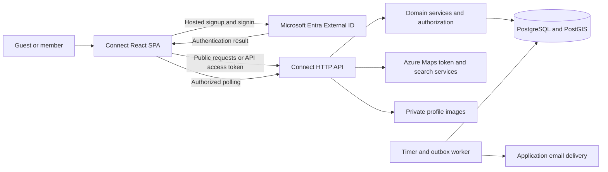
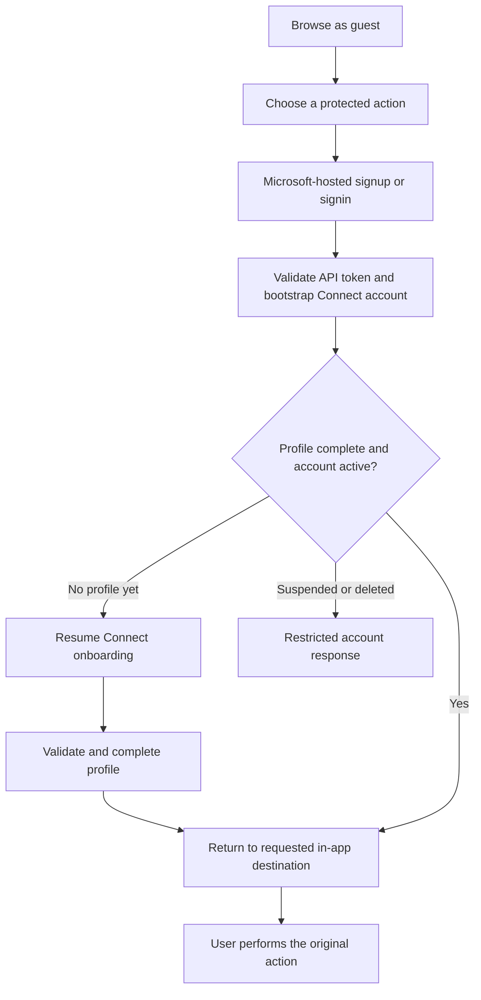
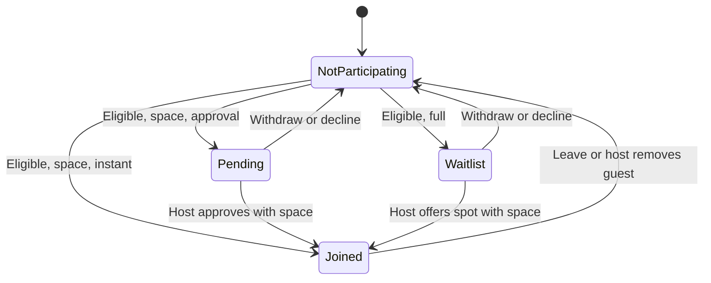
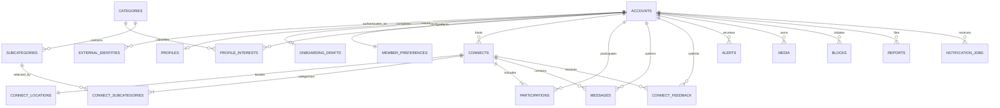
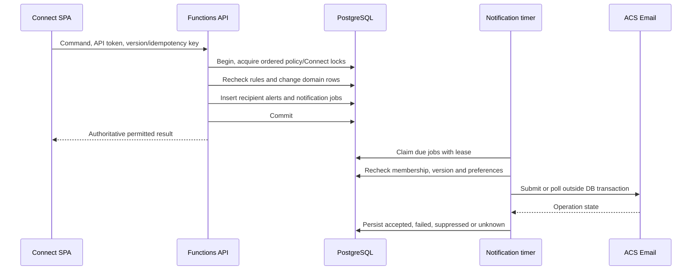
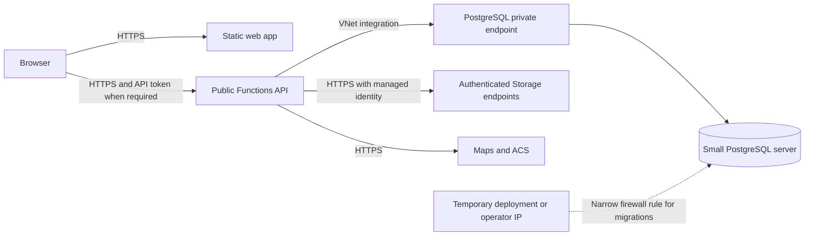

# Connect: flow-driven application and backend architecture

> Find Your People.

## 1. Purpose and status

This document defines a production architecture from the flows implemented in
the current Connect frontend. It is a standalone design, not an amendment to
`Architecture.md`.

**Implemented today:** a React/TypeScript SPA with local fixture data,
session-scoped Zustand state, interactive forms, and optional Azure Maps service
contracts. There is no implemented application backend, database, or real
authentication integration in this repository.

**How to implement from this document:** sections 1-16 explain the product and
flow boundaries. Sections 17 onward specify the production implementation:
deployment inputs, physical data model, function contracts, Azure resources,
configuration, provisioning, and release evidence. These are design contracts,
not evidence that resources or backend code have already been created.

**Confirmed authentication decision:** Microsoft-hosted **Entra External ID**
signup/signin, followed by Connect's own profile onboarding. Connect retains
birth date, gender, interests, location, photo, and privacy preferences in its
application database. It does not own passwords.

**First-release scale:** 10-100 users. Use one small production environment,
one backend application, one PostgreSQL server, and basic managed services.
Do not introduce enterprise infrastructure or distributed subsystems for
unmeasured future demand. Production correctness still requires real
authentication, server-side privacy, transactions, backups, and visible errors.

The current domain name is **Connect** (`Connect`, `connectId`, `connects`).
This document uses matching names for proposed API resources and database
tables; "gathering" in explanatory prose describes the same product entity.

The services, database entities, and application endpoints below are the
**proposed backend**, unless explicitly identified as existing. They support
observable frontend behavior; they do not turn fixture badges, simulated loading,
or local mutations into claims of working production services.

### 1.1 Product boundary

The application loop is:

**Browse -> authenticate when needed -> complete a profile -> join or host ->
coordinate in a group -> meet -> review past activity.**

In scope are discovery, profiles, hosting and editing, attendance approval,
waitlists, link sharing, group chat, alerts, calendar downloads, ratings,
reporting, and blocking.

Not implied by the current frontend are payment processing, delivered invitation
campaigns, calendar synchronization, direct messaging, automatic waitlist
promotion, verified physical attendance, or an AI recommendation system.

### 1.2 Frontend sources that drive the design

| Surface | Implementation reference | Backend responsibility |
| --- | --- | --- |
| Routes and access gates | `src\App.tsx`, `src\components\Shell.tsx` | Identity, onboarding state, and resource authorization |
| Signup and profiles | `src\features\identity\SignupPage.tsx`, `ProfilePage.tsx`, `identity.ts` | Profile validation, uniqueness, privacy, preferences, media |
| Discovery and detail | `src\features\discovery\DiscoverPage.tsx`, `DetailPage.tsx`, `sortConnects.ts` | Filtered queries and viewer-specific Connect projections |
| Hosting | `src\features\hosting\HostPage.tsx`, `hostSchema.ts`, `hostTime.ts` | Drafts, publication, editing, time and place invariants |
| Host management | `src\features\hosting\ManagePage.tsx`, `hostingActions.ts` | Approval, waitlist admission, guest removal, cancellation |
| Shared domain state | `src\lib\types.ts`, `src\lib\store.ts` | Durable records, transactional commands, authoritative rules |
| My Connects and feedback | `src\features\community\MyConnectsPage.tsx`, `feedback.ts` | Personal activity projections and eligible feedback |
| Chat and alerts | `src\features\community\ChatPage.tsx`, `AlertsPage.tsx` | Authorized message history, messaging, per-recipient alerts |
| Calendar and meeting details | `src\features\community\calendar.ts`, `place.ts` | Permission-filtered source data, not a calendar integration |
| Maps and place search | `src\components\MapView.tsx`, `LocationPicker.tsx`, `src\lib\api.ts` | Maps tokens, search, and validated location data |

## 2. System shape

Use a **modular monolith**: one versioned application API, one relational
database, and two small timer functions in the same backend application. Hosting,
participation, privacy, and alerts share transactions; separate microservices
would make those existing flows harder to implement correctly.

### 2.1 Recommended deployment

| Component | Proposed technology | Reason derived from the frontend |
| --- | --- | --- |
| Web application | Existing React, TypeScript, Vite SPA on Azure Static Web Apps | Independently addressable client routes; no server-rendering requirement |
| Application API | Node.js/TypeScript Azure Functions, v4 programming model, HTTP triggers | Bounded queries and commands; shared language and Zod contracts |
| Background processing | One notification timer and one cleanup timer in the same Function app | Durable work without a broker or separate worker deployment |
| Transactional data | Azure Database for PostgreSQL Flexible Server with PostGIS | Membership uniqueness, capacity transactions, spatial filtering, relational profiles |
| Database access | `pg`, explicit repositories, versioned SQL migrations | Transactions need a single acquired connection and visible lock boundaries |
| Authentication | Microsoft Entra External ID customer tenant | Approved Microsoft-hosted signup/signin |
| Maps | Azure Maps Web SDK and server-side search/token integration | Existing map and location-picker contracts |
| Profile images | Private Azure Blob Storage with controlled application reads | Existing optional image upload, without database data URLs |
| Application email | Azure Communication Services Email | Existing notification preferences, with actual delivery handled asynchronously |
| Operations | Application Insights and managed identity; Key Vault only if an actual remaining secret requires it | Basic error visibility and credential-free service access |

A standalone Functions origin preserves the existing `VITE_API_BASE_URL`
contract. Do not assume a Static Web Apps API proxy. Flex Consumption is a
candidate hosting plan; confirm regional networking support and cold-start,
latency, and capacity requirements before provisioning it.

Chat initially uses authenticated HTTP polling, not a separate real-time
service. This supports the implemented send/history/thread screens without
introducing presence, typing indicators, or WebSocket infrastructure.



The SPA never connects directly to PostgreSQL. Customer identities never
receive infrastructure RBAC or database roles.

### 2.2 Module boundaries

| Module | Owns |
| --- | --- |
| Identity and profiles | Identity mapping, onboarding, profiles, contact sharing, preferences, avatars |
| Catalog and discovery | Fixed taxonomy, category counts, filtering, ordering, map-safe results |
| Connects | Drafts, publication, edits, visibility, locations, cancellation |
| Participation | Joining, pending requests, waitlists, leaving, approvals, removals |
| Community | Message history, sending, My Connects, ratings and attendance feedback |
| Notifications | Alert inbox, read state, recipient selection, email/reminder work |
| Safety | Block relationships, reports, account restrictions, audit events |
| Provider adapters | Entra token validation, Azure Maps, Blob Storage, email |

Modules call shared domain services rather than duplicating permission logic in
HTTP handlers. A UI-disabled button is never the implementation of a rule.

## 3. Authentication and Connect onboarding

### 3.1 Separate identity from the application profile

Entra answers **who authenticated**. Connect answers **who the member is within
this application, what they share, and what they can do**.

| Entra owns | Connect owns |
| --- | --- |
| Credentials and credential policy | Application account ID and status |
| Signup, signin, recovery, configured MFA | Name, immutable username, bio, avatar |
| Configured email or federated signin methods | Birth date and withholding choice; derived age; gender |
| Identity-provider verification | Interests, profile location, discovery radius |
| Authentication tokens and provider session | Contact email/phone, independent sharing consent, notification preferences |

Microsoft-hosted does not require Microsoft-account-only signin. Configure the
customer user flow with the supported methods the product chooses. The current
Google/Apple buttons are not evidence that those providers are configured.

Use the Microsoft authentication libraries for the React SPA and authorization
code flow with PKCE. Register the SPA and the Connect API, expose the API's
delegated scope, and configure exact development/production redirect URIs.
There is no client secret in the SPA, implicit grant, password grant, custom
Connect token issuer, or application password endpoint.

This design deliberately does **not** use Entra native authentication or a
credential-forwarding proxy. The Connect email/password and recovery forms
become entry points to the Microsoft-hosted experience.

### 3.2 Identity-to-account mapping

After provider authentication, the SPA obtains an **access token for the Connect
API** and calls `POST /api/v1/me/bootstrap`.

The API validates signature, trusted issuer, intended audience, lifetime, and
required delegated scope using provider metadata and supported JWT validation.
It must reject an ID token or a Microsoft Graph token presented as a Connect
API credential.

Map the validated `(issuer, subject)` identity to a stable, server-generated
application account ID under a unique database constraint. Bootstrap is
idempotent: concurrent calls cannot create two profiles for one identity.
Email, display name, and browser-supplied user IDs are not identity keys.

Return account status, onboarding status, and the permitted own-profile
projection. Do not silently link separately authenticated accounts by matching
their email addresses.

### 3.3 Onboarding after authentication

The existing seven-stage signup becomes six Connect-owned stages after the
provider completes authentication:

| Stage | Retained frontend information |
| --- | --- |
| 1. Name and username | Display name and unique Connect username |
| 2. Personal details | Contact email, optional birth date, withholding choice, gender, optional phone, sharing controls |
| 3. Photo | Optional profile image |
| 4. Interests | At least two categories for initial onboarding |
| 5. Location and preferences | Optional neighborhood/city and default radius |
| 6. Review and complete | Public-profile preview, then continue browsing or hosting |

Remove the Connect-owned password stage. Prefill contact email from provider
data when available, but do not assume every identity has an email claim or
that an arbitrary email claim proves a notification address is verified.
Retain the valid-contact-email requirement in Connect's personal-details
stage, including an editable input when a provider supplies no usable value.

Save onboarding progress separately from a completed profile. Validate a
partial stage when saving it and the complete profile when finishing.
Authenticated users with incomplete onboarding may resume it or browse public
content; they cannot publish, join, chat, report, or rate until onboarding is
complete. Enforce this in the API, not only through route navigation.



Carry a validated same-origin `returnTo` through authentication and onboarding.
Reject external, protocol-relative, malformed, or authentication-loop targets.
The SDK owns OAuth state/nonce handling; `returnTo` is not a substitute for it.
Returning to a gathering does not automatically join it or bypass its current
eligibility and capacity rules.

### 3.4 Sessions and account changes

Keep authentication state under MSAL, separate from persisted application
state. Prefer an in-memory token cache; let the SDK handle renewal and
interaction-required responses rather than copying tokens into Zustand.

On signout or account change, clear authenticated query results, chat history,
profile data, sensitive form state, and user-scoped local drafts. An expired
token must not leave protected content available through stale application
caches. Provider signout and local cleanup are both required.

Profile contact email is distinct from the Entra signin identifier. Editing it
does not change login credentials. Reset its sharing consent on change, and
require verification before using a new address for application email. The
contact-verification UX is additional integration work; do not invent a
successful verification state in the existing form.

## 4. Frontend boundaries and routes

Retain React Router, CSS Modules, React Hook Form, Zod, the shared components,
centralized copy modules, and lazy-loaded feature screens. Preserve the
Connect visual language, nine-category colors, and existing layout/theme
controls.

Replace the local profile-presence gate with an authentication/onboarding gate.
Backend permissions remain authoritative regardless of the route.

| Route | Intended access |
| --- | --- |
| `/`, `/discover`, `/categories`, `/connect/:id` | Public, with a guest-safe projection |
| `/signup` | Entra entry when signed out; Connect onboarding when authenticated |
| Authentication callback route | New SDK integration route; not currently implemented |
| `/host`, `/connect/:id/edit`, `/connect/:id/manage` | Completed active profile; editing/management additionally require host ownership |
| `/mine`, `/chats`, `/chats/:id`, `/alerts` | Completed active profile and resource-specific permissions |
| `/profile`, `/profile/:id` | Completed active profile; only the owner can edit |
| `/kit` | Existing public component sheet; no special backend privileges |

The hidden preview toolbar remains a presentation aid, not an administrative
interface. My Connects' simulated Loaded/Loading/Empty/Error states and
Discover's timed reload animation must become actual request states in the
connected application.

Use a typed API boundary with shared Zod contracts. Keep editable UI state in
Zustand where useful, but do not treat persisted gathering arrays, locally
computed permissions, or fixture profiles as server truth. On a successful
command, apply the returned authoritative projection and invalidate affected
detail, discovery, My Connects, thread, and alert queries.

Public and authenticated requests may share routes but must not share
personalized response caches. Use `Cache-Control: no-store` for sensitive
profile, location, chat, and account responses.

## 5. Domain and persistence model

Database records are not serialized versions of the current Zustand store.
Normalize identities, memberships, locations, and messages, then construct the
DTOs each screen needs.

### 5.1 Core entities

| Entity | Important data and constraints |
| --- | --- |
| `accounts` | UUID, account status, onboarding status, timestamps; no passwords |
| `external_identities` | Account FK, trusted issuer and subject, unique identity pair |
| `onboarding_drafts` | Account owner, partial profile values, current stage, version |
| `profiles` | Account FK, normalized unique username, name, bio, contact details and email-verification state, birth date, withholding flag, gender, sharing flags, avatar reference, version |
| `member_preferences` | Default radius and email/reminder/message preferences; separate from profile sharing |
| `categories`, `subcategories` | Stable keys, configured parent-child relationships |
| `profile_interests` | Unique account/category pairs |
| `connects` | Host, category, authored text, start/end instants, IANA timezone, capacity, join policy, visibility, roster privacy, skill, eligibility rule, cost, lifecycle status, version |
| `connect_subcategories` | Unique Connect/subcategory pairs; enforce matching parent category |
| `connect_locations` | Location type, public area/point, separate exact venue/point, meeting instructions, online/undecided notes, privacy |
| `hosting_drafts` | Owner and slot (`new` or an owned gathering ID), values, stage, furthest stage, base gathering version, draft version |
| `participations` | Unique gathering/account pair; active state `joined`, `pending`, or `waitlist`; request note and ordering timestamps/sequence |
| `participation_events` | Audit of requests, decisions, leaves, removals, and cancellations without creating a permanent declined-member ban |
| `messages` | Gathering, author account, text, server timestamp, monotonic ordering key |
| `connect_feedback` | Unique Connect/rater pair, host rating, optional attendance feedback, timestamps |
| `alerts` | Recipient, kind, referenced gathering/event, safe content references, read timestamp, creation time |
| `blocks` | Unique blocker/blocked pair; prohibit self-blocking |
| `reports` | Reporter, target kind/ID, reason, details, operational status, timestamps |
| `media` | Owner, blob reference, validated type/size, processing state |
| `notification_jobs` | One PostgreSQL-backed transactional outbox/job table for notifications and reminders |
| `idempotency_records`, `audit_events` | Command deduplication and protected operational history |

Use foreign keys, uniqueness constraints, check constraints, and transaction
rules together. No API accepts writable rating totals, host identity,
verification badges, or attendance arrays from a caller.

### 5.2 Catalog

Taxonomy is configured, not created by members.

| Category | Subcategories |
| --- | --- |
| Sports | Football/Soccer, Basketball, Volleyball, Tennis/Padel, Running, Cycling, Swimming, Climbing, Other |
| Gaming | PC, Console, Board games, Tabletop RPG, Card games, Arcade/LAN, Other |
| Social | Movie night, Bar crawl, House party, Karaoke, Dinner/Potluck, Coffee meetup, Other |
| Outdoors | Hiking, Beach, Picnic, Camping, Dog walk, Other |
| Arts & Culture | Live music, Museums, Theater, Photography walk, Crafts, Other |
| Learn & Make | Language exchange, Study group, Coding/Hack night, Workshops, Book club, Other |
| Wellness | Yoga, Gym session, Meditation, Group walk, Other |
| Family & Kids | Playground meetup, Kids' sports, Family outing, Other |
| Other | Anything else |

A gathering has one parent category and at least one distinct subcategory
belonging to that parent. Changing the parent clears invalid subcategory
selections. Choosing an Other activity requires its own description, not a new
taxonomy row.

Use stable enum/option keys in API and database contracts, with labels supplied
by `src\copies`. Do not parse localized strings such as "Over 18" to make
authorization decisions. Map the current display-valued form options through
an explicit frontend adapter.

### 5.3 Temporal, eligibility, and monetary values

Store start/end as UTC instants (`timestamptz`) plus the intended IANA timezone.
Store date of birth as a calendar date, not an instant or an aging integer.
Reject invalid supplied dates and derive age at the decision time under a
documented calendar policy.

Represent age constraints structurally, with optional inclusive minimum and
maximum ages. A separate optional gender requirement supports existing
women-only fixtures. The current discovery/hosting UI does not expose general
gender-filter or gender-rule creation; do not imply that it does.

Cost modes are `free`, `split`, `own`, and `ticketed`. The current currency is
ILS. Store amounts as integer minor units with a currency code. Split cost is
a total shared across confirmed attendees, including the host; ticketed cost
is per person. Preserve the UI's clearly estimated, rounded split display.
Free and pay-your-own have no entered amount. There is no payment, checkout,
refund, or ticket-issuance subsystem.

### 5.4 Current frontend contract mapping

Follow the refactored field names rather than restoring the older abbreviated
model. Where production needs a different shape, make the conversion explicit:

| Current frontend field | Production boundary |
| --- | --- |
| `categoryKey`, `subcategoryNames` | Stable category/subcategory keys in writes; localized names in display projections |
| `timeZone`, `startsAt`, `endsAt` | IANA timezone and validated UTC instants |
| `locationType` | `physical`, `online`, or `undecided`; no legacy `tbd` value |
| `latitude`, `longitude`, `distanceKilometers` | Public discovery coordinates/distance; separate authorized exact-point detail |
| `publicAreaLabel`, `venueName`, `meetingInstructions`, `meetingNotes` | Distinct public and protected location fields |
| `isGuestListPrivate`, `joinRequests`, `waitlist` | Policy-aware summaries; names only in permitted projections |
| `costType`, `costAmount` | Cost-type key and an explicit adapter to integer minor-unit amounts |
| `phoneNumber`, `biography`, `avatarDataUrl` | Retain contact/bio semantics; replace the local data URL with an authorized media reference |
| `attendanceRate`, `hostAttendanceRate`, `isVerified`, `isHostVerified` | Server-supported values only; unavailable/unverified until evidence and policy exist |
| `hostedConnectCount`, `connectId`, `isRead`, `isPinned` | Consistent Connect references and explicit boolean/count names |

## 6. Profiles, privacy, and images

### 6.1 Profile rules

Preserve the current name/username/contact validation, optional bio and
location, avatar choices, and 1-100 km default radius. Initial onboarding
requires at least two interests; later profile editing may change or remove
interests as the current editor permits.

Username is unique, normalized case-insensitively, and read-only after
onboarding. The database resolves concurrent claims to the same username.
Name edits update future projections of the member rather than requiring
rewrites of copied host/attendee names in every gathering.

Email, phone, gender, and age each have independent, initially disabled public
sharing. Changing an email/phone value resets that value's consent. Removing a
phone disables phone sharing. Withholding or removing birth date disables age
sharing.

`birthDateWithheld` preserves the owner's entered date but excludes it from
eligibility and public age computation until reversed. Other members never
receive the date of birth. Missing or withheld dates block age-restricted
joining, not ordinary browsing or account creation.

Return separate own-profile and member-profile DTOs. The own-profile response
contains editable private fields; the member projection contains only allowed
fields and visible activity. Public-profile preview uses that same projection,
not a client-side attempt to hide private fields.

The implemented host request view needs identity, a request note, and the
eligibility outcome. It does not require revealing an applicant's undisclosed
gender or date of birth. Do not add an implicit demographic-sharing exception.

### 6.2 Profile activity and badges

Other members' activity excludes link-only gatherings and private-roster
participation, except that hosting a publicly listed gathering is public.
The owner can see their own eligible private activity. Cancelled gatherings
stay in My Connects history rather than appearing as active profile activity.

Host ratings may be aggregated from eligible submitted host ratings; the
account cannot write the aggregate. Define hosted-count semantics consistently
from completed, non-cancelled hosting records. Return unavailable values when
there is no supporting data.

The current reliability percentages and verification badges are fixture
values, not established scoring or verification systems. A successful Entra
signin does not verify physical identity or attendance. Group-level
"someone was a no-show" feedback cannot determine which person missed a
gathering. Do not fabricate per-person reliability or award a verified badge
from those inputs.

### 6.3 Avatars

Support the current PNG, JPEG, GIF, and WebP formats up to 1 MiB. The server
must enforce size, signature/type agreement, successful decoding, and safe
pixel/decompression limits independently of browser validation.

Store processed images in private Blob Storage, remove unnecessary metadata,
and serve only media references/read routes permitted by profile projection.
Do not store base64 images in profile rows, accept arbitrary remote image URLs,
or expose upload credentials. Ownership checks govern replacement and removal;
clean up abandoned uploads and superseded media according to retention policy.

## 7. Discovery, Maps, and location privacy

### 7.1 Discovery query

The server applies visibility and viewer policy before filtering, counting,
ordering, or pagination. Discover includes only published, non-ended,
Everyone-visible gatherings, excluding blocked relationships for authenticated
viewers. Category counts use the same visibility rules and their declared
filter scope; do not count hidden gatherings.

Support the existing query inputs:

| Input | Behavior |
| --- | --- |
| `q` | Search title, host name, public area, category, and subcategory |
| `category`, `subcategory` | Multiple parent categories; subcategory must belong to a selected parent |
| `radius` | 1-100 km, defaulting to the saved member preference where available |
| Search center | Manual place selection held in client memory; a public area fallback when not selected |
| `when` | Any time, today, tomorrow, this week |
| `level`, `age`, `cost` | Existing skill, age-group, and cost-mode options |
| `spots` | Exclude full capacity-limited gatherings when enabled |
| `sort` | Distance, relevance, popularity |

Today/tomorrow filters use interval overlap, so ongoing gatherings are not
discarded simply because they started earlier. Pass an explicit search
timezone to preserve the current browser-calendar interpretation; do not use
the server machine's local timezone.

Distance ordering uses the public discovery point, with no-distance results
after located results. Relevance follows existing text-match/interests
weighting, not an AI model. Popularity uses confirmed attendance. Break ties
by start time, then Connect ID, matching `sortConnects.ts`.

Use PostGIS geography and a spatial index for radius filtering, with supporting
indexes for published/time/category and membership queries. Apply the complete
filter set before keyset pagination. Bind cursors to the query, sort, search
context, and viewer; cap page sizes. Mutable popularity and edits can reorder
results between requests, so cursor pagination is not a frozen snapshot.
Deduplicate on the client and restart the query on refresh or context changes.

List and map consume the same filtered result set. Page them together rather
than independently querying a differently filtered map. A future
viewport/cluster endpoint is not required by the current UI.

### 7.2 Physical, online, and undecided places

| Mode | Coordinates | Meeting details |
| --- | --- | --- |
| Physical | Confirmed exact point; public point equal to it or generalized | Venue and optional meeting instructions |
| Online | None | Optional meeting link/instructions |
| To be decided | None | Optional plans for choosing a meeting place |

Online/TBD gatherings have no fabricated distance or marker and are not
excluded solely because they have no physical radius match. Switching place
modes clears incompatible location fields. Selecting Online initially enables
private meeting details as in the wizard; subsequent visibility still follows
the explicit privacy control.

Persist exact and public location data separately. For a private physical
place, require a host-authored public neighborhood/area and derive a
generalized discovery point. Use that point for public coordinates, radius
matches, ordering, and distance labels, preventing indirect exact-location
disclosure through search results.

The current preview rounds the sole stored coordinate pair. Production must
not copy that lossy model: retain the exact point separately so authorized
attendees receive the correct meeting point and switching privacy does not
destroy the original location.

### 7.3 Viewer-specific disclosure

| Viewer | Private meeting details | Private roster names |
| --- | --- | --- |
| Guest or unrelated member | Hidden | Hidden |
| Pending or waitlisted member | Hidden | Hidden |
| Confirmed attendee | Visible | Hidden |
| Host | Visible | Visible |

Public meeting details are visible to anyone permitted to open the gathering.
A public roster exposes the confirmed roster, not pending requests or
waitlists. Counts and current-user attendance can be returned without exposing
other members' identities.

Apply these rules to cards, avatar stacks and accessible labels, details, map
markers, profile activity, chat previews, alerts, and calendar source data.
The current card/avatar exceptions are implementation gaps, not permission
rules. Hidden values must be absent from unauthorized API responses.

Link-only is an **unlisted URL**, not an access-control list or invitation
token. Anyone with the link can open its permitted public projection and
request/join under normal rules. Exclude it from discovery and other members'
public activity. Do not describe sharing the link as granting confirmed access.

### 7.4 Existing Maps integration contract

Keep these existing frontend contracts:

| Route | Response |
| --- | --- |
| `GET /api/v1/maps/token` | `{ "token": "<short-lived Maps token>" }` |
| `GET /api/v1/locations/search?q=...` | `{ "results": [{ "label": "...", "latitude": 32.1, "longitude": 34.8 }] }` |

Location search needs `VITE_API_BASE_URL`. Map rendering additionally needs the
public `VITE_AZURE_MAPS_CLIENT_ID`. The Maps SDK obtains a short-lived token
through its existing callback; no subscription key or client secret belongs
in `VITE_*` configuration.

Guest map/search access is deliberately supported. Rate-limit and bound these
public provider-proxy routes independently of member authentication. Use a
narrowly privileged Maps identity, explicit CORS, provider timeouts, and
`Cache-Control: no-store` for tokens. Search is debounced/cancellable in the
client; preserve retry and unavailable states and keep list discovery usable.

Selected search coordinates must not enter frontend URLs, share links, or
telemetry. Send discovery coordinates in a request body, not its URL.
Signup's geolocation action currently only acknowledges permission; it does
not geocode a profile location or set a persistent search center.

Known venue fixtures are a demo fallback, not production geocoding. Respect
Azure Maps attribution and provider-data retention terms, and distinguish
provider-derived labels from host-authored public areas and instructions.

## 8. Hosting, editing, and drafts

### 8.1 Wizard

Preserve the eight hosting stages:

**Category -> subcategories -> words -> when -> where -> rules -> details ->
review**, followed by publication/save confirmation.

Title is required; description and what-to-bring are optional. Other activity
details are required only when the selected taxonomy calls for them. Capacity
includes the host and may be unlimited. The host is inserted as a confirmed
participant in the publication transaction.

Preserve the wizard's current validation bounds, including title length,
optional text limits, valid parent/subcategory combinations, positive
split/ticketed amounts, and confirmed physical pins.

For a scheduled gathering, validate local date/time and IANA timezone and
resolve the selected instant server-side. Reject nonexistent daylight-saving
times; require first/second occurrence only for repeated local times. Do not
accept an arbitrary client-supplied UTC offset as proof of a valid time.

For Happening now, assign the start using server time at publication. An end
is always required, later than start and still in the future. Editing an
ongoing gathering preserves its unchanged original start; it must not restart
the gathering simply because the edit was submitted later.

### 8.2 Draft lifecycle

Maintain one `new` draft slot per member and one edit-draft slot per owned
gathering, matching the current wizard keys rather than inventing a
multi-draft management screen.

Save and close explicitly persists values, current stage, furthest visited
stage, and version. Draft validation permits incomplete forms but rejects
malformed/oversized data and unauthorized ownership. A saved draft is private,
not a gathering, and never appears in discovery or reserves attendance.

Reopening restores the draft; discarding removes it and resets defaults.
Publication/editing validates the complete payload. If a saved draft is
involved, check its version and clear only that version in the successful
transaction. Never delete another tab's newer draft.

An edit draft records the gathering version it was based on. If host controls
or another tab changed the gathering, surface a conflict for review instead of
overwriting newer settings. The current frontend uses version-2 storage keys
and no longer migrates legacy offset-valued drafts. Version future server-draft
schemas explicitly; do not automatically import client-owned production data.

### 8.3 Management

Only the host may edit details, toggle rules, inspect requests/waitlists,
approve/decline, remove a confirmed guest, or cancel. The host cannot remove
themselves or leave their own gathering.

Private meeting details force approval and disable instant joining. Turning
privacy off makes instant joining available but does not automatically switch
an approval gathering to instant. Enabling physical-place privacy requires a
public area; the original venue address must not become the public label.

Capacity cannot be lowered below confirmed attendance. Increasing capacity
does not automatically promote waiting members. Changing eligibility rules
does not silently evict confirmed attendees; apply the new rules to subsequent
join/admission decisions.

Ended/cancelled gatherings are not editable and cannot accept new
participants. Cancellation preserves confirmed attendance and history, clears
pending/waitlist entries, records an optional reason, and creates notification
work. Ending is derived from the stored end time; it does not depend on a
browser timer or require a worker to mark a row ended.

## 9. Participation state and transactions

### 9.1 State transitions

Eligibility requires a completed active profile, an available gathering, no
disqualifying block relationship, and matching configured age/gender rules.
Skill level is a descriptive filter; the current frontend does not maintain
member skill credentials for eligibility enforcement.

| Command | Preconditions | Result |
| --- | --- | --- |
| Join with space, instant policy | Eligible, no active participation | `joined` |
| Join with space, approval policy | Eligible, no active participation | `pending`, optional note |
| Join when full | Eligible, no active participation | `waitlist`, regardless of join policy |
| Repeat join | Already on a list | Return existing state; do not duplicate |
| Approve pending request | Host, still eligible, capacity available | `joined` |
| Offer waitlist spot | Host, still eligible, capacity available | Immediately `joined`; no later acceptance stage |
| Decline request/waitlist entry | Host, active gathering | Remove active entry; keep an audit event |
| Leave or withdraw | Member owns participation, active gathering, not host | Remove active entry |
| Remove confirmed guest | Host, active gathering, target is not host | Remove attendance and its protected access |
| Cancel | Host, active gathering | Preserve confirmed history; clear pending/waitlist |
| Reach end time | Time predicate | Freeze changes and message sending; preserve historical list state |



All diagram transitions are subject to the gathering's active lifecycle.
Account restrictions and safety-related access revocation still apply to
historical gatherings; freezing ordinary participation changes does not freeze
authorization.
Decline/removal is not a permanent ban; joining again is allowed if current
rules permit it. There is no automatic FIFO promotion, timed offer, reservation,
or overbooking grace period. Waitlist order supports the displayed position,
not a promise that the host must admit the next person.

### 9.2 Transaction protocol

For every attendance-affecting command:

1. Authenticate and resolve the actor; never trust `hostId` or acting-member IDs in the request body.
2. Acquire a database connection and begin a transaction.
3. Acquire required account/policy locks in a consistent order, then lock affected gathering rows in ID order.
4. Reload account status, blocks, current participation, capacity, lifecycle, and eligibility using server time.
5. Apply the change, audit event, recipient alerts, and durable outbox work atomically.
6. Commit, then return the current viewer-safe projection.

Use row locks such as `SELECT ... FOR UPDATE` on the same acquired connection.
Joining, approving, removing, cancelling, publishing, and capacity changes must
share this protocol; checking a count before the transaction is insufficient.
The unique participation constraint is additional protection, not a
replacement for serializing capacity decisions.

Profile eligibility changes and blocking use the same account/policy locking
discipline. A block locks the relevant account pair before affected gathering
rows, so a concurrent join cannot commit based on a stale no-block check.
Recheck eligibility during approval, not only when the original request was
created.

Use bounded transaction timeouts and consistent lock ordering. External
provider calls and email sending must not occur while holding these locks.

### 9.3 Versions and retries

Use optimistic versions/ETags for profile edits, gathering edits, drafts, and
preferences. Return a conflict rather than silently accepting stale edits.

Use actor-scoped idempotency keys for publication, joining, decisions, message
sending, reports, and other retryable creation commands. Bind each key to its
operation, target, and request hash. Save the idempotency result in the same
transaction; reject reuse with a different payload.

Reauthorize retries and reconstruct their permitted response. A stored
idempotency response must not replay an exact address or chat payload after
membership was revoked.

## 10. My Connects, sharing, and calendar

### 10.1 Personal activity groups

| Tab | Server query |
| --- | --- |
| Hosting | Active published gatherings owned by the member |
| Joined | Active published gatherings the member joined, excluding their own hosting |
| Invites | Active pending requests and waitlist entries |
| Past | Related ended or cancelled gatherings retained by hosting/participation state |

Sort active groups by start ascending and Past by start descending.
Pending/waitlist entries that reach their end time appear as closed requests,
not attended events. Cancellation clears those entries, matching the current
store behavior; it does not fabricate attendance history for them.

Tab counts and lists must use the same authorization and grouping rules.
Return eligibility for rate/chat/edit actions from the API rather than
inferring it from the tab name alone.

### 10.2 Invitations and sharing

Invite friends and Share link copy the gathering URL. There is no invitation
record, recipient acceptance workflow, contact import, or invitation email
service implied by these buttons.

The Invites tab's current name does not change its pending/waitlist semantics.
Durable gathering records make newly shared links resolvable across browsers;
the current session-only fixture implementation cannot provide that.

### 10.3 Calendar export

Keep client-side `.ics` generation using the existing calendar helper and
authorized DTOs. Use UTC start/end instants, stable gathering UID, escaping,
line folding, and the appropriate cancellation status. Export private meeting
details only when the current viewer is entitled to receive them.

Add to calendar downloads a file. It does not request Microsoft Graph calendar
permissions, synchronize later edits, subscribe to updates, or remove events
from someone else's calendar. Explain that copies already exported cannot be
revoked when a member later leaves or is blocked.

## 11. Group chat, alerts, and feedback

### 11.1 Group chat

One logical conversation belongs to each gathering. Pending/waitlisted
members can see a locked thread shell but not messages, private pinned
details, or message snippets. Only confirmed attendees, including the host,
can read messages. Ended/cancelled conversations remain readable to retained
confirmed participants but reject new messages.

Validate text after trimming: 1-2,000 characters. Assign author identity,
timestamp, message ID, and ordering sequence on the server. A client message ID
or idempotency key prevents duplicates after a network retry; it does not let
the client choose another author.

Return paginated history and poll for messages after the last sequence while
the conversation is active in the UI. Back off on errors/rate limits, pause
background-tab polling, and refresh permissions on focus. On access loss,
clear visible history and snippets; every read/send request is reauthorized.

Render plain text safely. Pinned meeting details derive from the latest
authorized gathering data. Fixture messages marked pinned are presentation
examples; there is no implemented user-facing pin/unpin or message-editing
workflow to design as a new feature.

### 11.2 Alerts and notification preferences

Alerts are per-recipient database records, not one browser-global array.
Support All/Unread, unread count, mark one/all read, and descending creation
order.

Preserve destination behavior: host request alerts go to management; message
alerts open chat only when the viewer still has access; other events open the
gathering or a safe unavailable state. Never expose a private message body
through an alert after chat access is revoked.

| Event | Intended recipients |
| --- | --- |
| Join/request/waitlist | Acting member's result; host updates where action is needed |
| Approval/decline/removal | Affected member |
| Material gathering edit/cancellation | Affected participants under current access policy |
| New message | Other confirmed participants, without unauthorized message previews |
| Scheduled reminder | Still-confirmed participants of the still-active gathering |

Notification preference is not profile-sharing consent. A private contact
email may receive application notifications if verified and permitted by the
email preference. Disabling reminders/messages disables that optional
notification category, not access to the gathering or conversation. Keep
essential in-app command/participation results available; apply category
preferences to optional alerts and delivery jobs consistently.

The current frontend only saves preferences and displays fixture/local alerts.
The exact reminder lead time, frequency, and essential-email policy are launch
configuration decisions, not timing guarantees already implemented.

### 11.3 Reliable background work

Write immediate recipient alerts and `notification_jobs` in the originating
transaction. For 10-100 users, select recipients and insert their jobs directly;
do not add a separate event bus, outbox-dispatch stage, or fan-out service.
`notification_jobs` itself is the transactional outbox. The single notification
timer claims due work using leases and `FOR UPDATE SKIP LOCKED`, then commits
the claim before contacting a provider.

Delivery is at least once. Deduplicate logical jobs and use provider-supported
idempotency where available; do not promise exactly-once email. Record
attempts, retry transient failures with bounded backoff, and surface exhausted
work for operational handling.

Before delivery, reload the gathering version, event-specific recipient
eligibility, block state, preferences, and verified delivery address. Skip
superseded reminders and reminder/message jobs for cancelled gatherings or
revoked recipients. Cancellation, decline, and removal outcomes instead use
their recorded affected recipients and safe terminal-event summaries; they
must not disappear merely because the event removed active participation.
Never include revoked meeting details or chat content in those summaries.
Schedule/reschedule reminder jobs from persisted start times and versions,
not `setTimeout` in a browser.

Minimize sensitive payloads in jobs and logs. Prefer entity references and
permission-checked rendering at delivery time to copied exact locations,
contact details, or full chat bodies.

### 11.4 Ratings and attendance feedback

Only a confirmed attendee can rate the host of a completed, non-cancelled
gathering hosted by someone else. Permit a 1-5 integer rating and updates to
the member's previous rating under a unique gathering/rater constraint.

Optional attendance feedback is `all` or `no-show`; it is not proof of an
identified person's presence or absence. Keep the reporter's original feedback
separate from any future reliability-scoring system. The frontend's current
host-rating and attendance-feedback storage can become one transactional
feedback command without changing the form.

## 12. Reporting, blocking, and authorization

Reporting saves a report with a target, reason, and optional details. It does
not automatically block anyone, remove a gathering, or imply a moderator has
reviewed it. Provide a restricted operational triage process before launch;
the member UI need not become a moderation console.

Blocking preserves the current host/member relationship behavior: remove the
blocker's participation in gatherings hosted by the blocked member, and
remove the blocked member from gatherings hosted by the blocker. Remove
pending/waitlist relationships as well. Revoke protected details/chat access
where confirmed participation was removed.

Unblocking does not restore prior attendance or requests. Decline, removal,
and block are different operations with different consequences.

Do not silently remove either person from unrelated third-party gatherings
they both attend. The current implementation does not define global
shared-room invisibility or deletion of historical messages; any stronger
block policy needs an explicit product decision.

Centralize policies for account status, onboarding, ownership, participation,
blocks, profile projection, and meeting/roster disclosure. Apply them to list,
detail, search counts, mutation results, exports, alerts, and provider adapters.
Use indistinguishable not-found/unavailable responses where revealing a hidden
resource's existence would disclose information.

Authorization to use Connect is not authorization to manage Azure resources.
Administrative operations require separately authorized operator identities;
customers must not self-assign roles or request moderation privileges through
profile updates.

## 13. API contract

All application routes use `/api/v1`. The Maps routes already exist as client
contracts; the remaining routes below are proposed.

### 13.1 Endpoint groups

| Method and path | Purpose |
| --- | --- |
| `POST /me/bootstrap` | Idempotently resolve/create the application account from the validated Entra identity |
| `GET /me` | Own account, onboarding status, profile, and preferences |
| `PUT /me/onboarding` | Save partial onboarding values and stage with a version |
| `POST /me/onboarding/complete` | Validate and activate a completed profile |
| `PATCH /me/profile` | Edit permitted profile fields and enforce consent resets |
| `PATCH /me/preferences` | Update radius and notification preferences |
| `GET`, `POST`, `DELETE /me/avatar` | Owner-authorized image reads, replacement, and removal, including during onboarding |
| `GET /members/{id}`, `GET /members/{id}/avatar` | Authorized member projection and profile media |
| `GET /catalog` | Stable categories, subcategories, and option keys |
| `POST /connects/search` | Filtered/paginated discovery, with coordinates in the body |
| `GET /categories/counts` | Viewer-filtered active category counts with an explicit query scope |
| `GET /connects/{id}` | Guest/member/host detail projection |
| `GET`, `PUT`, `DELETE /me/hosting-drafts/{slot}` | Resume, explicitly save, or discard a private draft |
| `POST /connects` | Validate and publish, including the host's confirmed participation |
| `PATCH /connects/{id}` | Host editing and management toggles with version checking |
| `POST /connects/{id}/cancel` | Host cancellation with optional reason |
| `POST /connects/{id}/participation` | Join/request/waitlist the authenticated member |
| `DELETE /connects/{id}/participation` | Leave or withdraw the authenticated member |
| `GET /connects/{id}/participants?state=...` | Host-only paginated management lists |
| `POST /connects/{id}/participants/{memberId}/decision` | Host approve/decline a pending or waitlisted member |
| `DELETE /connects/{id}/participants/{memberId}` | Host removes a confirmed non-host guest |
| `GET /me/connects?tab=...` | My Connects tab results and counts |
| `GET /me/threads` | Authorized/locked conversation summaries |
| `GET`, `POST /connects/{id}/messages` | Authorized message pagination and sending |
| `GET /me/alerts` | All/unread alerts, cursor and unread count |
| `POST /me/alerts/{id}/read`, `POST /me/alerts/read-all` | Mark recipient-owned alerts read |
| `PUT /connects/{id}/feedback` | Eligible host rating and optional attendance feedback |
| `POST /reports` | Record a report with validated target/reason |
| `GET /me/blocks`, `PUT`, `DELETE /me/blocks/{memberId}` | List, block, and unblock relationships |
| `GET /maps/token`, `GET /locations/search` | Existing Maps integration contracts |

There are no Connect `/login`, `/password`, payment, invitation-delivery, or
calendar-sync endpoints in this architecture. Profile-contact verification and account deletion are specified in sections
19-20 as small additional production workflows. They are not credential
management or a separate identity platform.

### 13.2 Request and response rules

Validate all inputs on the server with allowlisted schemas and bounded text,
body, and page sizes. Share contract definitions, not database models, with
the SPA. Keep display-copy ownership in `src\copies`; stable error codes map
to those modules.

An error has a stable shape:

```json
{
  "error": {
    "code": "CAPACITY_FULL",
    "requestId": "<request-id>",
    "fields": {}
  }
}
```

Use 401 for absent/invalid required authentication, 403 for disallowed
operations, 404 for unavailable resources, 409 for version/state conflicts,
422 for validation failures, and 429 with retry guidance for rate limits.
Do not turn provider/database failures into empty successful result sets.

Commands return current state, version, relevant counts, and permitted actions
for their caller. Reconcile from that response rather than incrementing
attendance optimistically and assuming the write succeeded.

No response exposes another member's Entra subject, private profile fields,
hidden roster identities, or unauthorized meeting details. Public read
endpoints with an invalid supplied bearer token must not silently retry as a
guest and confuse authenticated state.

## 14. Operational and implementation boundaries

### 14.1 Deployment and operations

Deploy the SPA and backend independently through one chosen CI/CD platform.
Build infrastructure reproducibly; select the IaC/pipeline tooling when the
deployment work is undertaken rather than infer it from frontend components.

Use private PostgreSQL networking and backend VNet integration, TLS
validation, and managed identities with least-privileged resource/database
roles. Refresh database authentication tokens when acquiring new connections.
Keep migration permissions separate from runtime permissions.

Bound connection pools, request concurrency, worker batch size, and outbound
provider timeouts. Database capacity must remain safe as the Function app
scales out. Prefer one database and the outbox until measured demand justifies
additional infrastructure.

Trace requests through command, transaction, and background delivery IDs.
Monitor failures, latency, lock contention, denied access, outbox age,
notification retry exhaustion, and provider throttling. Exclude tokens,
birth dates, private contacts, precise search coordinates, and message bodies
from logs and analytics.

Require backups and tested restoration, migration rollback/forward recovery,
retention for drafts/messages/reports/media, and an account deletion process.
Define how deletion affects hosted future gatherings and retained participant
history before public launch; authentication-provider deletion alone is not
application data deletion.

### 14.2 Frontend-to-backend replacement

| Current implementation | Connected implementation |
| --- | --- |
| `loadSampleProfile` or locally completed profile | Entra authentication plus server onboarding status |
| `connect-state-v2` Connect/profile arrays | Authorized API queries and durable database records |
| Local store mutation as the final result | Validated transactional command and authoritative response |
| Session-only hosting draft | Owner-scoped explicit server save with optimistic version |
| Data URL avatar | Validated private media reference |
| Local messages and fixture alerts | Authorized message APIs and recipient-specific alert records |
| Separate local rating/attendance stores | Server-validated feedback transaction |
| Rounded sole location point | Distinct public and exact location data |
| Whole gathering object shared across screens | Per-viewer summary/detail/management DTOs |
| Simulated reload/error controls | Real request status, retry, and conflict handling |

Keep fictional data in an explicit demo mode. Do not upload the existing
session store, fictional identities, badge values, reports, or attendance into
production as a migration.

The current fixture source is `src\copies\data\connects.json`. Browser state
uses `connect-state-v2`, hosting uses
`connect-host-draft-v2:<profileId>:<connectId-or-new>`, and attendance feedback
uses `connect-community-feedback-v2`. These are local namespaces, not server
account boundaries or import contracts.

### 14.3 Proposed code organization

The current frontend folders remain in place. Backend/contracts directories
below are proposed, not existing implementation:

```text
src\
  components\
  copies\
  features\
  lib\
    api\                 Auth-aware requests and typed client adapters
    auth\                MSAL integration and onboarding routing

contracts\
  identity\
  connects\
  participation\
  community\

server\
  src\
    functions\           HTTP and timer entry points
    modules\             Domain services and policies
    repositories\        PostgreSQL queries and transactions
    projections\         Viewer-safe DTO construction
    providers\           Entra, Maps, Blob, email adapters
    workers\             Outbox and scheduled notification processing
  migrations\
```

Do not introduce a monorepo framework, message broker, distributed cache,
gateway, or additional auth provider merely to create this folder structure.

### 14.4 Delivery sequence

1. Establish shared contracts, database migrations, authorization policies, and Entra configuration.
2. Connect hosted authentication, account bootstrap, resumable onboarding, profile privacy, and image storage.
3. Connect catalog/discovery, Maps, and viewer-safe gathering details.
4. Connect hosting/drafts/editing and transactional participation, cancellation, and blocking.
5. Connect My Connects, chat, alerts, outbox delivery, feedback, and reporting.
6. Remove production dependence on fixtures and complete operational/privacy release gates.

Each phase must preserve the corresponding existing screen flow. In
particular, exercise concurrent last-spot requests, stale edits, duplicate
submissions, interrupted onboarding, expired tokens, blocked relationships,
private roster/location projections, DST transitions, access-revoked chat,
and stale reminder jobs.

Current repository commands remain `npm ci`, `npm run dev`,
`npm run check:copies`, `npm run build`, and `npm run preview`. The copy checker
is a separate heuristic command; Vite injects centralized document metadata.
No backend build, migrations, automated test runner, deployment pipeline, or
Entra setup is created by this document.

## 15. Decisions still required before launch

These are not reasons to change the approved authentication/onboarding split:

| Decision | Why the frontend cannot answer it |
| --- | --- |
| Entra tenant, domains, signin methods, MFA and recovery policy | Provider buttons currently show unavailable states |
| Minimum age, launch regions, restricted activities, and age-calculation policy | Optional demographic fields do not establish legal eligibility rules |
| Verified badge and individual reliability policy | Existing values are fixtures; group no-show feedback is insufficient |
| Reminder timing and essential/optional delivery policy | Preferences exist, but no durable delivery schedule exists |
| Editable contact-email verification | Profile editing is implemented; verification is not |
| Stronger blocking semantics in third-party group chats | Current blocking only changes reciprocal host/member participation |
| Moderation ownership, response targets, retention, and account deletion | Reports and local block actions are not moderation operations |
| Availability targets, expected scale, region, budget, and recovery objectives | A local frontend cannot determine production capacity or SLA |

## 16. Microsoft identity references

The approved approach uses Microsoft-hosted authentication; native
authentication is not required to retain Connect's own onboarding data.

- [Create customer signup/signin user flows](https://learn.microsoft.com/en-us/entra/external-id/customers/how-to-user-flow-sign-up-sign-in-customers)
- [Choose browser-delegated or native authentication](https://learn.microsoft.com/en-us/entra/external-id/customers/concept-choose-authentication-approach)
- [Access tokens and API validation responsibilities](https://learn.microsoft.com/en-us/entra/identity-platform/access-tokens)

## 17. Implementation baseline and required inputs

### 17.1 What "production ready" means here

The sizing assumption is **10-100 users for the first iteration**, not
thousands of concurrent clients. Optimize for a small team that can understand,
deploy, and operate the complete system.

The default is one Functions app, one small PostgreSQL server without HA/read
replicas, one storage account with separate containers, hosted Entra auth,
Maps, low-volume email, and basic monitoring. No Kubernetes, Redis, Service
Bus, APIM, Front Door/WAF, multi-region failover, separate admin application,
permanent build-runner VM, generic workflow engine, or Graph lifecycle service
is required for this iteration.

Implement every required function, migration, resource connection, and
operational workflow in the following sections. A frontend flow is not complete
merely because its HTTP route exists: authorization, private projections,
transactional updates, asynchronous consequences, and failure handling must
also work. Infrastructure deployment alone is not application readiness.

The architecture has three kinds of decisions:

| Kind | Treatment by a future implementation or provisioning task |
| --- | --- |
| Confirmed product contract | Preserve it: Entra-hosted auth, Connect onboarding, current participation/visibility/cost semantics |
| Recommended technical baseline | Implement the stated starting value; make it configurable and validate it under the intended workload |
| Required deployment/policy input | Stop the applicable production release step when absent; never silently select a tenant, region, budget, legal policy, or production recipient |

Do not replace a missing prerequisite with a public database, a connection
string checked into code, a fabricated notification, or a disabled permission
check.

### 17.2 Deployment input manifest

Create a validated environment manifest before generating production IaC.
Keep references and public identifiers in it, not secret values.

| Input | Constraint or required decision |
| --- | --- |
| `environment` | One `prod` environment initially; local development uses isolated data and auth configuration. Add a separately provisioned staging environment only when needed |
| `subscriptionId`, `workloadTenantId` | Explicit Azure subscription and its resource/workload identity tenant |
| `customerTenantId`, `customerAuthority`, `customerApiAudience` | Entra External ID customer tenant; independently configured from the workload tenant |
| `resourceRegion`, `dataResidencyRegion` | Supported service intersection, residency approval, and a documented exception for any differently located service |
| `namePrefix`, `uniqueSuffix`, resource-group names | Stable per environment, Azure naming rules, globally unique names where required |
| `webOrigin`, `apiOrigin`, registered callback/logout URIs | Exact HTTPS production origins and owned DNS zones/domains |
| `vnetAddressSpace`, subnet prefixes, DNS integration | Non-overlapping with any existing connected networks; capacity for planned scale |
| `productionLoadProfile` | 10-100 users initially; measure active chat polling and email/day rather than size for hypothetical enterprise traffic |
| `monthlyBudget`, operational owner | Budget alert thresholds and who can approve a capacity/quota increase |
| `availabilityTarget`, `RPO`, `RTO` | Business-approved objectives; not a promise inferred from an Azure SKU |
| `emailDomain`, `senderAddress`, DNS owner | Verified application sender and a responsible owner for DNS and deliverability |
| `pipelineProvider`, repository and environment approvers | One simple pipeline with federated identity and a production approval; no permanent private runner unless later necessary |
| `legalAgePolicy`, `ageCalculationTimeZone` | Minimum registration age, restricted-activity policy, leap-day handling, and geographic scope |
| `retentionPolicyVersion`, `deletionPolicyVersion` | Approved retention periods, exceptions, deletion grace period and completion deadline |
| `notificationPolicyVersion`, `reminderOffsetsMinutes` | Essential versus optional messages and approved reminder schedules |

The deployment pipeline must check quotas, available SKUs/versions, private
networking support, domain control, role-assignment rights, and required Entra
administrator consent before making the environment public.

### 17.3 Suggested configurable guardrails

These are conservative starting settings, not measured capacity guarantees.
Tune them through the release workload scenarios and provider quotas.

| Setting | Initial technical recommendation |
| --- | --- |
| JSON request size | 64 KiB, except the separately bounded avatar upload |
| Avatar upload | 1 MiB file; decoded image at most 16 megapixels; reject unsupported or oversized decoding |
| Collection page size | Default 25, maximum 100; roster, messages, alerts and management lists are independently paginated |
| Visible chat polling | 5 seconds while visible; pause in hidden tabs, exponential backoff up to 60 seconds on transient failures |
| Ordinary API deadline | 15 seconds; expensive work becomes a durable job instead of increasing this indefinitely |
| Database acquisition/query/transaction budget | 2 seconds acquire, 5 seconds statement, 10 seconds transaction; 2 seconds lock timeout |
| PostgreSQL pool per process | Maximum 5 connections initially; validate the aggregate budget before selecting app scale limits |
| Provider HTTP deadline | 5 seconds for Maps; 10 seconds per email-provider operation request |
| Job claim | At most 25 jobs per batch; 2-minute lease; heartbeat before half the lease elapses |
| Transient job retry | Exponential backoff with jitter, maximum 8 attempts; exhausted or ambiguous work remains visible to operators |
| Client command idempotency | Retain deduplication records at least 24 hours; long-lived provider jobs retain their own dedupe identity |
| Contact verification | 32 cryptographically random token bytes, 30-minute validity, at most 5 attempts, at most 3 sends per account/hour |
| Abuse limiter | Shared enforcement across instances; privacy-preserving caller keys and short-lived counters |

Configure rate budgets per route class, not one universal limit. A starting
policy is 60 public search requests/IP/minute, 20 Maps token requests/IP/minute,
30 message sends/member/minute, and 10 join/publication mutations/member/minute.
These are abuse controls, not usage entitlements; account for shared NAT
addresses, accessibility retries, and the actual Maps/email provider quotas.
Return `429` and `Retry-After`, not a misleading successful response.

For an initial single-database deployment, short-lived PostgreSQL
`rate_limit_buckets` provide shared atomic counters without introducing Redis.
Use bounded expiry cleanup and hashed/HMAC-derived keys, not stored raw IPs.
Protect connection capacity under abusive ingress; an edge/WAF control is
required if the measured public exposure can exhaust the database limiter.
Do not trust forwarded client-IP headers unless they come through the
configured trusted Azure ingress.

## 18. Physical database specification

### 18.1 Schema conventions

Use one application schema named `connect_app`. The table names below are
unqualified for readability. Separate runtime and migration/administrator
database roles without introducing another database or operational service.

Notation: `?` means nullable; all other columns are `NOT NULL`. `PK`, `FK` and
`UQ` mean primary key, foreign key and unique constraint. `M` adds
`created_at timestamptz DEFAULT now()`, `updated_at timestamptz DEFAULT now()`,
and `version bigint DEFAULT 1 CHECK (version > 0)`. `A` adds only
`created_at timestamptz DEFAULT now()`. Mutable tables explicitly marked `M`
use version checks for client edits; worker lease updates use lease tokens.

UUIDs are server-generated. Never accept a caller-selected actor/owner ID.
Use `text` plus named `CHECK` constraints for evolving state codes rather
than PostgreSQL enum types that complicate rolling schema migrations.
Serialize timestamps as UTC ISO 8601, dates as `YYYY-MM-DD`, and identifiers
as strings. JSONB is limited to explicitly versioned, validated document
payloads; it is not a substitute for relational membership or authorization.

### 18.2 Entity relationships



The diagram shows domain relationships, not cascading-delete instructions.
Deletion is defined separately and must not erase another member's history.

### 18.3 Identity and profile tables

| Table | Columns in addition to convention | Keys and essential rules |
| --- | --- | --- |
| `accounts` (M) | `id uuid`, `status text DEFAULT 'onboarding'`, `onboarding_completed_at timestamptz?`, `policy_version bigint DEFAULT 1`, `deleted_at timestamptz?` | PK `id`; status is `onboarding`, `active`, `suspended`, `deletion_pending`, or `deleted`; `policy_version` increments on authorization-affecting changes |
| `external_identities` (A) | `id uuid`, `account_id uuid`, `issuer text`, `subject text`, `provider_object_id text?`, `last_authenticated_at timestamptz` | PK `id`; FK account; UQ `(issuer, subject)`; provider object ID is recorded only from a validated provider claim when needed for lifecycle operations |
| `onboarding_drafts` (M) | `account_id uuid`, `schema_version integer`, `stage smallint`, `values jsonb`, `expires_at timestamptz` | PK/FK account; stage 0-5; values must exclude password, tokens, provider claims and unsupported fields; completion deletes the draft transactionally |
| `profiles` (M) | `account_id uuid`, `name varchar(80)`, `username varchar(24)`, `username_key text GENERATED ALWAYS AS (lower(username)) STORED`, `contact_email varchar(254)`, `contact_email_verified_at timestamptz?`, `contact_email_version bigint DEFAULT 1`, `phone_number varchar(30)?`, `gender text DEFAULT 'unspecified'`, `birth_date date?`, `birth_date_withheld boolean DEFAULT false`, `biography varchar(500) DEFAULT ''`, `location_label varchar(100) DEFAULT ''`, `share_email boolean DEFAULT false`, `share_phone boolean DEFAULT false`, `share_gender boolean DEFAULT false`, `share_age boolean DEFAULT false`, `avatar_media_id uuid?` | PK/FK account; UQ username key; username 3-24 ASCII letters/digits/underscore; name trimmed length 2-80; gender `unspecified`, `woman`, `man`; FK avatar with same-owner enforcement |
| `member_preferences` (M) | `account_id uuid`, `default_radius_km smallint DEFAULT 5`, `email_enabled boolean DEFAULT true`, `reminders_enabled boolean DEFAULT true`, `messages_enabled boolean DEFAULT true` | PK/FK account; radius 1-100; baseline values preserve current form defaults and must pass the approved notification-consent policy |
| `profile_interests` (A) | `account_id uuid`, `category_key text` | Composite PK; FK account and category; onboarding requires 2-9 choices, editing permits 0-9 |
| `contact_verifications` (A) | `id uuid`, `account_id uuid`, `email_version bigint`, `token_digest bytea`, `expires_at timestamptz`, `attempt_count smallint DEFAULT 0`, `send_status text`, `provider_operation_id text?`, `consumed_at timestamptz?`, `invalidated_at timestamptz?` | PK ID; FK account; UQ token digest; binds verification to current contact-email version; one unconsumed active challenge per account/version through a partial unique index |

Profile writes reset consent atomically when contacts change. An email edit
also clears its verification timestamp, increments `contact_email_version`,
invalidates previous challenges, and suppresses obsolete email jobs. Validate
date and phone semantics in shared contracts. Database checks additionally
forbid shared age without a supplied/non-withheld date, shared phone without
a number, and shared gender when unspecified.

Do not persist Entra passwords or signin tokens in these tables. Contact-email
verification is application data, not an attempt to change Entra credentials.

### 18.4 Catalog, Connects, and drafts

| Table | Columns in addition to convention | Keys and essential rules |
| --- | --- | --- |
| `categories` | `key text`, `sort_order smallint`, `enabled boolean DEFAULT true` | PK key; UQ order; seed the nine approved stable keys, not user-defined categories |
| `subcategories` | `key text`, `category_key text`, `sort_order smallint`, `enabled boolean DEFAULT true` | PK key; FK category; UQ `(key, category_key)` and `(category_key, sort_order)`; display names remain in centralized copy |
| `connects` (M) | `id uuid`, `host_id uuid`, `category_key text`, `title varchar(100)`, `description varchar(3000) DEFAULT ''`, `what_to_bring varchar(500) DEFAULT ''`, `other_description varchar(500) DEFAULT ''`, `starts_at timestamptz`, `ends_at timestamptz`, `time_zone text`, `creation_mode text`, `location_type text`, `location_visibility text DEFAULT 'public'`, `capacity bigint?`, `join_policy text DEFAULT 'instant'`, `visibility text DEFAULT 'everyone'`, `is_guest_list_private boolean DEFAULT false`, `skill_level text DEFAULT 'open'`, `age_min smallint?`, `age_max smallint?`, `required_gender text?`, `cost_type text DEFAULT 'free'`, `cost_amount_minor integer DEFAULT 0`, `currency char(3) DEFAULT 'ILS'`, `status text DEFAULT 'published'`, `moderation_state text DEFAULT 'visible'`, `cancellation_reason varchar(500)?` | PK ID; FK host/category; UQ `(id, category_key)` for taxonomy FK; title 5-100; end after start; host ID immutable; moderation independent of host cancellation |
| `connect_subcategories` | `connect_id uuid`, `category_key text`, `subcategory_key text` | PK `(connect_id, subcategory_key)`; composite FKs `(connect_id, category_key)` and `(subcategory_key, category_key)` enforce the same parent |
| `connect_locations` (M) | `connect_id uuid`, `public_area_label text`, `public_point geography(Point,4326)?`, `exact_venue text?`, `exact_point geography(Point,4326)?`, `meeting_instructions varchar(500) DEFAULT ''`, `meeting_notes varchar(500) DEFAULT ''` | PK/FK Connect; points use longitude/latitude order when constructed; physical mode requires both points; nonphysical modes require both null |
| `hosting_drafts` (M) | `id uuid`, `owner_account_id uuid`, `slot text`, `connect_id uuid?`, `schema_version integer`, `values jsonb`, `stage smallint`, `furthest_stage smallint`, `base_connect_version bigint?`, `expires_at timestamptz` | PK ID; FKs owner/Connect; UQ `(owner_account_id, slot)`; slot is `new` or the owned Connect ID; stages 0-7 and furthest at least current; no participant rows |

Named checks enforce creation mode `now|later`, location type
`physical|online|undecided`, visibility `everyone|link_only`, location visibility
`public|private`, join policy `instant|approval`, and skill
`open|beginner|intermediate|advanced`. Private meeting details require approval.
Finite capacity is 1-9007199254740991; null means unlimited and is not a
different queue policy. Monetary amounts are 0-100000000 minor units; free/own
require zero and split/ticketed require a positive amount. Age limits are
nonnegative, ordered when both present, and supported by the configured age
policy. `required_gender` is null or a supported requirement code.

Validate maximum provider-label length through the provider adapter; use a
bounded 500-character service contract for `exact_venue` and public labels
derived from it. A host-entered private public-area label remains 2-100
characters. Do not silently truncate an address into a different place.

Publication requires at least one valid subcategory, one location record, and
the host's joined participation. Enforce cross-row invariants through
transactional services and deferred constraint triggers where SQL checks
cannot express them. In particular, a capacity edit or membership write must
lock the Connect before counting confirmed rows. Do not use a drift-prone
client-supplied `confirmed_count`.

### 18.5 Participation and community tables

| Table | Columns in addition to convention | Keys and essential rules |
| --- | --- | --- |
| `participations` (M) | `connect_id uuid`, `account_id uuid`, `state text`, `request_note varchar(500) DEFAULT ''`, `queue_sequence bigint GENERATED ALWAYS AS IDENTITY`, `joined_at timestamptz?` | Composite PK and FKs; state `joined|pending|waitlist`; joined timestamp iff joined; host remains joined; index for each state and queue order |
| `participation_events` (A) | `id uuid`, `connect_id uuid`, `subject_account_id uuid`, `actor_account_id uuid?`, `event_type text`, `previous_state text?`, `resulting_state text?`, `command_id uuid`, `connect_version bigint` | PK; FKs; audit outcomes include withdrawal/decline/removal; do not store reusable private request bodies in event payloads |
| `messages` (A) | `id uuid`, `sequence bigint GENERATED ALWAYS AS IDENTITY`, `connect_id uuid`, `author_account_id uuid`, `text varchar(2000)`, `redacted_at timestamptz?` | PK ID; UQ sequence; FKs; trimmed nonempty text before redaction; author/timestamp server-owned; allocate sequence after the Connect lock so commits cannot be missed by per-room forward polling |
| `connect_feedback` (M) | `connect_id uuid`, `rater_account_id uuid`, `stars smallint`, `attendance_feedback text?` | Composite PK/FKs; stars 1-5; feedback null, `all`, or `no_show`; host derived from Connect, never caller-supplied |
| `alerts` (A) | `id uuid`, `recipient_account_id uuid`, `connect_id uuid?`, `event_id uuid`, `kind text`, `template_key text`, `safe_parameters jsonb`, `read_at timestamptz?` | PK; FKs; UQ `(recipient_account_id, event_id, kind)`; parameters exclude protected location/message text; read state owned by recipient |
| `blocks` (A) | `blocker_account_id uuid`, `blocked_account_id uuid`, `event_id uuid` | Composite PK/FKs; not self; reverse-pair index; policy checks both directions for reciprocal hosted participation |
| `reports` (M) | `id uuid`, `reporter_account_id uuid`, `target_account_id uuid?`, `target_connect_id uuid?`, `reason_code text`, `details varchar(1000) DEFAULT ''`, `status text DEFAULT 'open'`, `resolution_code text?`, `resolved_at timestamptz?` | PK/FKs; exactly one target; status `open|triaged|resolved|dismissed`; customer writes cannot set operational fields |

Removing participation does not cascade-delete messages, feedback, reports,
or historical audit. Completed participation is retained unless a documented
safety/deletion workflow changes its visibility or pseudonymizes the member.

Public roster and management lists are distinct projections. Paginate a
public roster through a separate read endpoint rather than exposing the
host-only pending/waitlist endpoint or returning an unbounded attendee array.

### 18.6 Media, jobs, and operational tables

| Table | Columns in addition to convention | Keys and essential rules |
| --- | --- | --- |
| `media` (M) | `id uuid`, `owner_account_id uuid`, `blob_name text`, `content_type text`, `size_bytes integer`, `width integer`, `height integer`, `content_digest bytea`, `state text`, `expires_at timestamptz?` | PK; FK owner; UQ blob name and `(id, owner_account_id)`; state `pending|ready|rejected|superseded|deleted`; only ready same-owner media can become an avatar |
| `notification_jobs` (M) | `id uuid`, `event_id uuid`, `recipient_account_id uuid`, `connect_id uuid?`, `connect_version bigint?`, `contact_email_version bigint?`, `kind text`, `template_key text`, `safe_parameters jsonb`, `dedupe_key text`, `not_before timestamptz`, `expires_at timestamptz?`, `state text`, `attempt_count integer DEFAULT 0`, `lease_token uuid?`, `leased_until timestamptz?`, `provider_operation_id text?`, `provider_message_id text?`, `provider_status text?`, `last_error_code text?` | PK/FKs; UQ dedupe key; kind `email|reminder`; state `pending|leased|submitted|accepted|suppressed|failed|unknown`; this table is the outbox; no credential/token payloads |
| `account_deletion_requests` (M) | `id uuid`, `account_id uuid`, `identity_digest bytea`, `policy_version text`, `requested_at timestamptz`, `execute_after timestamptz`, `state text`, `provider_deletion_state text`, `completed_at timestamptz?`, `last_error_code text?` | PK/FK account; one open request per account; deletion is performed by the named operator using a repeatable admin procedure, not a new identity service |
| `idempotency_records` (A) | `actor_account_id uuid`, `operation text`, `key text`, `request_digest bytea`, `command_id uuid`, `resource_id uuid?`, `result_code text`, `expires_at timestamptz` | Composite PK `(actor_account_id, operation, key)`; stores outcome references, not replayable private DTOs |
| `audit_events` (A) | `id uuid`, `actor_account_id uuid?`, `operator_identity text?`, `action text`, `target_type text`, `target_id uuid?`, `request_id text`, `safe_metadata jsonb` | PK; customer actor or authenticated admin-command identity; append-only to runtime role; do not log secret/request-body contents |
| `rate_limit_buckets` | `key_digest bytea`, `route_class text`, `window_start timestamptz`, `request_count integer`, `expires_at timestamptz` | Composite PK on digest/class/window; atomic increment; bounded short-lived retention |
| `schema_migrations` | `version text`, `checksum text`, `applied_at timestamptz`, `release_id text` | PK version; deployment role only; fail on changed checksum |

Use a lease token as a fencing token: completion/heartbeat updates must match
both job ID and the current token. An expired worker must not overwrite a
new worker's result. A job in `unknown` after an ambiguous provider send is
not blindly retried as a new email.

### 18.7 Required indexes and read shapes

| Access path | Required index or query strategy |
| --- | --- |
| Resolve authenticated account | UQ `external_identities(issuer, subject)`; index account FK; identity-deletion digest lookup |
| Username lookup/claim | UQ `profiles(username_key)` |
| Category/subcategory discovery | `connects(category_key, status, starts_at, id)`; `connect_subcategories(subcategory_key, connect_id)` |
| Public active discovery | Partial index for `status='published' AND moderation_state='visible'`; put `ends_at > now()` in the query, not a time-dependent partial-index predicate |
| Spatial filtering | GiST `connect_locations(public_point)`; `ST_DWithin` in meters, with exact points excluded from public sorting/filtering |
| Text search | Parameterized normalized search document over public fields; initially PostgreSQL full-text/trigram indexes as appropriate to preserve substring matching; enable only selected supported extensions |
| Host dashboard | `connects(host_id, status, starts_at, id)` |
| My Connects and membership checks | `participations(account_id, state, connect_id)` plus its composite PK |
| Requests/waitlist/confirmed count | `participations(connect_id, state, queue_sequence)` |
| Chat paging | `messages(connect_id, sequence)`; author FK index for deletion/redaction |
| Alert inbox/unread count | `alerts(recipient_account_id, created_at DESC, id)` and partial unread index where `read_at IS NULL` |
| Ratings | `connect_feedback(connect_id)` and host aggregation through Connects; no writable aggregate cache initially |
| Jobs | Partial due-work indexes over `(available_at/not_before, id)` for pending states, plus leased-until recovery indexes |
| Moderation/expiry | Reports `(status, created_at, id)`; all expiring tables indexed by `expires_at` |

Preserve current relevance weights in a tested shared scoring specification:
selected interest +20, exact title +100 or title contains +60, subcategory
match +45, category match +30, public area +15, host name +10. Database
candidate filtering must not substitute incompatible full-text semantics for
the current substring match. Bind values; never concatenate raw filters,
identifiers, or sort directions into SQL.

### 18.8 Migration and deletion discipline

Apply migrations in this order: schemas/roles/extensions; accounts and catalog;
profiles/preferences/media; Connects and locations; participation/community;
outbox/operations; indexes and deferred invariants; deterministic catalog
seeds. Resolve the profile/avatar FK after both tables exist. Seed stable keys,
not sample profiles, Connects, messages, ratings, or passwords.

Use explicit `RESTRICT` on durable account/Connect/history relationships.
`CASCADE` is limited to subordinate data intentionally deleted with its
parent, such as a discarded private draft or selected taxonomy join rows.
The account-deletion worker deletes personal profile/draft/media records and
pseudonymizes retained history under the approved policy; it does not issue
a broad account-row cascade.

Run one migration job using a PostgreSQL advisory lock, a migration-only
identity, a checksum-verified artifact, and private network access. Use
expand/backfill/contract migrations across releases. `CREATE INDEX
CONCURRENTLY` requires an explicitly nontransactional migration step. A
failed migration halts deployment; restoring an old executable must not imply
automatically reversing a destructive data migration.

## 19. Backend function and DTO implementation contract

### 19.1 Common handler pipeline

Every HTTP function follows:

**Request ID -> size/rate limits -> route-bound identity validation ->
account/onboarding/policy -> Zod input -> service transaction/query ->
viewer-safe DTO -> stable response.**

Register HTTP routes under the Functions `api` prefix with `v1/...` route
templates; do not accidentally publish `/api/api/v1/...`. Function-key
authorization is not member authentication. When Functions `authLevel` is
`anonymous` to allow mixed guest/bearer routes, the shared handler must enforce
the identity policy listed below before domain code runs.

Actor codes: `G` guest-safe read with optional valid customer token; `I`
authenticated non-deleted account including onboarding; `M` completed active
member; `H` owning host; `J` confirmed participant. Account-deletion status/cancel endpoints additionally allow the
requesting `deletion_pending` account. `H` and `J` also require active account
policy; historical read exceptions are explicit, not permission bypasses.

Use `If-Match` for versioned writes and `Idempotency-Key` for retryable command
creation. Standardize collection responses as
`{ items, nextCursor, total?, asOf }`; `total` must use the same policy and
filter scope. Large integer ordering keys are encoded as strings. A cursor
is opaque, integrity-protected, bounded, and tied to the viewer/query context.

### 19.2 Required response DTOs

| DTO | Required content and exclusions |
| --- | --- |
| `Me` | Account ID/status, onboarding state/draft when incomplete, own profile, preferences, versions; no provider tokens/subject |
| `MemberProfile` | Name/username/bio/authorized image, interests, permitted contact/demographic fields, visible activity pages and evidence-backed stats; no birth date |
| `ConnectSummary` | Identity/category/subcategories, title, public place/distance, time/cost, safe host summary, counts, viewer attendance, visibility badges, version; no hidden names or exact location |
| `ConnectDetail` | Summary plus authored details, permitted meeting data, roster visibility/count/first page, current viewer feedback and capabilities |
| `HostParticipantPage` | Host-only selected state, member-safe identity, request note, eligibility outcome, queue position; no undisclosed DOB/gender |
| `ParticipationResult` | Connect ID/version, current attendance state, counts, permitted actions, related operation status |
| `ThreadSummary` | Connect ID/title, access state, safe latest snippet only for readers, archive state |
| `MessagePage` | Ordered message IDs/sequences, author-safe display, text, server times and redaction state; no arbitrary account fields |
| `AlertPage` | Recipient-owned safe alerts, unread count, current permitted destinations |
| `Operation` | Operation ID, state, optional retry/poll location; never claim queued work has finished |

Never expose a pending/waitlist note through a public roster DTO. The display
adapter may preserve existing component props, but must not manufacture hidden
fields or copy another viewer's cache.

### 19.3 HTTP function catalog

The names are proposed code/export names. Paths are relative to `/api/v1`.
All columns describe server behavior, not trusted client assertions.

| Function | Route and actor | Input -> output | Entities/transaction and consequences |
| --- | --- | --- | --- |
| `bootstrapAccount` | `POST /me/bootstrap` I | Valid Entra API token -> `Me` | Unique identity/account lookup/create plus default preferences; deny deletion tombstones |
| `getMe` | `GET /me` I | None -> `Me` | Owner-only account/profile/draft/preferences query |
| `saveOnboarding` | `PUT /me/onboarding` I | Partial values, stage, version -> saved draft/version | Own draft; allow only onboarding account; no activation |
| `completeOnboarding` | `POST /me/onboarding/complete` I | Complete values + version/idempotency -> `Me` | Account/profile/interests/preferences/media ownership atomically; username conflict -> 409; delete draft |
| `updateMyProfile` | `PATCH /me/profile` M | Editable allowlist + ETag -> own profile/version | Consent/email-version reset, verification invalidation, policy-version bump where needed |
| `updatePreferences` | `PATCH /me/preferences` M | Radius/notification flags + ETag -> preferences/version | Persist flags; suppress obsolete optional jobs on send-time recheck |
| `getMyAvatar` | `GET /me/avatar` I | Current reference -> safe image/404 | Own ready media; supports onboarding preview |
| `uploadMyAvatar` | `POST /me/avatar` I | Bounded image + command key -> media reference/status | Media ownership, validation/blob workflow; no success before ready |
| `deleteMyAvatar` | `DELETE /me/avatar` I | Current reference/version -> 204 | Detach profile/draft pointer, mark superseded and queue blob cleanup |
| `getMember` | `GET /members/{id}` M | Member ID/cursors -> `MemberProfile` | Centralized member/activity projection |
| `getMemberAvatar` | `GET /members/{id}/avatar` M | Member ID -> safe image/404 | Apply same member/visibility policy; never accept arbitrary blob name |
| `getCatalog` | `GET /catalog` G | None -> catalog/version | Enabled stable taxonomy and option keys; cache only nonpersonal catalog data |
| `searchConnects` | `POST /connects/search` G | Filters, center, timezone, cursor -> summary page | PostGIS plus all visibility/block filters before sorting/paging |
| `getCategoryCounts` | `GET /categories/counts` G | Declared non-coordinate scope -> counts | Counts of visible active Connects; no hidden aggregate leakage |
| `getConnect` | `GET /connects/{id}` G | ID -> `ConnectDetail`/404 | Viewer-safe data, capability and feedback projection |
| `getConnectRoster` | `GET /connects/{id}/roster` G | ID/cursor -> permitted roster/count | No names if roster policy denies them; never pending/waitlist data |
| `getHostingDraft` | `GET /me/hosting-drafts/{slot}` M | Slot -> draft/version or 404 | Owner and current host eligibility |
| `saveHostingDraft` | `PUT /me/hosting-drafts/{slot}` M | Incomplete validated values/stages + ETag -> draft | Private slot uniqueness; record base Connect version |
| `deleteHostingDraft` | `DELETE /me/hosting-drafts/{slot}` M | ETag -> 204 | Delete only the matching owned version |
| `publishConnect` | `POST /connects` M | Complete host payload, optional draft version, key -> detail | Insert Connect/location/subcategories/host participation/outbox atomically |
| `updateConnect` | `PATCH /connects/{id}` H | Editable values + ETag -> detail | Lock Connect; time/privacy/capacity checks; updated event, reminder reschedule |
| `cancelConnect` | `POST /connects/{id}/cancel` H | Optional reason, version, key -> detail | Cancel plus participation cleanup/audit/recipient event atomically |
| `joinConnect` | `POST /connects/{id}/participation` M | Optional note, key -> `ParticipationResult` | Account/policy and Connect locks; choose joined/pending/waitlist; create result/event |
| `leaveConnect` | `DELETE /connects/{id}/participation` M | Own current participation -> result | Never host; active lifecycle; remove/audit and revoke access |
| `listHostParticipants` | `GET /connects/{id}/participants` H | State/cursor -> host page | State-scoped counts/list; profile-safe projection |
| `decideParticipation` | `POST /connects/{id}/participants/{memberId}/decision` H | `approve|decline`, key -> result | Recheck subject eligibility/capacity under locks; offer spot is immediate approval |
| `removeParticipant` | `DELETE /connects/{id}/participants/{memberId}` H | Target/current version -> result | Remove confirmed non-host; audit/result event |
| `getMyConnects` | `GET /me/connects` M | Tab/cursor -> summaries/counts | Matching Hosting/Joined/Invites/Past queries |
| `getThreads` | `GET /me/threads` M | Cursor -> thread page | Locked shells for waiting members; latest messages only for readers |
| `getMessages` | `GET /connects/{id}/messages` J | Before/after sequence, limit -> message page | Reauthorize every page; allow archived retained participants |
| `sendMessage` | `POST /connects/{id}/messages` J | Trimmed text, key -> saved message | Lock active Connect, allocate sequence, insert message/outbox; no sends after end/cancel |
| `getAlerts` | `GET /me/alerts` M | All/unread, cursor -> alert page | Recipient scope, safe destinations and unread count |
| `markAlertRead` | `POST /me/alerts/{id}/read` M | ID -> read state/count | Update owned row only; idempotent |
| `markAllAlertsRead` | `POST /me/alerts/read-all` M | None -> read state/count | Mark rows visible to the statement snapshot, not subsequently created alerts |
| `saveConnectFeedback` | `PUT /connects/{id}/feedback` M | Stars, optional attendance + version -> own feedback | Joined non-host, completed non-cancelled Connect; upsert unique rating |
| `createReport` | `POST /reports` M | Exactly one target, reason/details, key -> report receipt | Validate access/target; record report/audit; no automatic punishment |
| `listMyBlocks` | `GET /me/blocks` M | Cursor -> owner block list | No unrelated relationships |
| `blockMember` | `PUT /me/blocks/{memberId}` M | Target -> result | Lock pair and affected Connects in order; insert block and revoke reciprocal hosted participation transactionally; no separate reconciliation service |
| `unblockMember` | `DELETE /me/blocks/{memberId}` M | Target -> 204 | Remove relation/update policy; never restore attendance |
| `startContactVerification` | `POST /me/contact-verification` M | Current contact version, key -> accepted/failed/unknown send status | Persist token digest, send through ACS outside transaction with token only in memory; explicit resend invalidates the previous challenge |
| `completeContactVerification` | `POST /me/contact-verification/complete` M | Challenge ID/token -> verified contact state | Atomic attempt/expiry/version/owner check; consume once |
| `requestAccountDeletion` | `POST /me/deletion` M | Explicit confirmation/version/key -> `Operation` | Mark deletion pending and hide protected access; record operator-owned request and safe notice |
| `getAccountDeletion` | `GET /me/deletion` I | None -> own operation | Also allowed for own deletion-pending account |
| `cancelAccountDeletion` | `POST /me/deletion/cancel` I | Request/version -> account state | Only within grace, before irreversible execution; never restores cancelled Connects or lost attendance automatically |
| `getMapsToken` | `GET /maps/token` G | None -> existing token contract | Shared abuse checks; least-privileged short-lived provider capability |
| `searchLocations` | `GET /locations/search` G | Bounded `q` -> label/latitude/longitude results | Provider adapter deadline, throttling and schema validation |
| `getLiveness` | `GET /health/live` G | None -> minimal up status | No identity/config/database details |
| `getReadiness` | `GET /health/ready` G | None -> minimal ready/not-ready status | Bounded DB/schema/config checks; no dependency names or diagnostics; rate-limit and cache the check briefly |

Contact verification happens **after** profile completion. The member can use
Connect through their authenticated Entra identity while the application
contact address is unverified; application email is withheld until verified.
This avoids a second partial-contact model inside onboarding.

### 19.4 Small-team administration

For 10-100 users, do not build an admin web application, an `/ops` API, or a
second application-authentication system. Provide a small, parameterized
`server\admin` command-line tool using the same domain services and an
explicitly authorized operator's database identity. Record operator identity,
reason and outcome in `audit_events`.

Required commands are: list/resolve reports, suspend/restore an account,
hide/restore a Connect, inspect/retry failed notification jobs, and
process/record account deletion. They are not public HTTP functions. The
hidden preview toolbar has no administrative authority.

The responsible owner handles occasional Entra user deletion through the
External ID administration portal and records the outcome in the application
deletion request. No Graph directory-write permission is granted to the
runtime managed identity. This is a deliberately manual, documented process
with an owner and deadline, not an unimplemented promise of automated deletion.

### 19.5 Timer functions and job contracts

Use six-field UTC NCRONTAB schedules. These initial cadences are configurable;
all due-work selection uses persisted timestamps, not assumed invocation
punctuality. A delayed/missed tick must catch up without duplicating results.

| Function | Initial trigger | Work and completion condition |
| --- | --- | --- |
| `processNotifications` | `0 * * * * *` | Claim due email/reminder jobs, recheck policy, initiate provider operations or poll existing operation IDs; record accepted/failure/unknown. New/changed attendance and Connect commands create/reschedule reminder rows directly |
| `cleanupExpiredData` | `0 15 2 * * *` | Bounded expiry of drafts/challenges/limiter buckets/idempotency/jobs plus abandoned/superseded media; recheck references and honor approved retention/holds |

Enable timer schedule monitoring for schedules where supported and appropriate.
Host storage is mandatory for timer coordination; database leases and
idempotency are still required across deployments, retries and worker crashes.
Prevent multiple production worker deployments from unintentionally becoming
active during rollback.

### 19.6 Event dictionary

An event here is command metadata, not a separate event-bus deployment or
mandatory `outbox` table. Each has `{ eventId, schemaVersion, type, aggregateId,
aggregateVersion, actorReference, occurredAt, safeReferences }`. Do not put
full private DTOs in it.

| Event family | Writer | Durable consumers |
| --- | --- | --- |
| `connect.published`, `connect.updated`, `connect.cancelled` | Host transaction | Direct alert/job inserts and reminder planning/rescheduling/cancellation |
| `participation.joined`, `.requested`, `.waitlisted`, `.approved`, `.declined`, `.left`, `.removed` | Participation transaction | Member/host result alerts and optional delivery; safe terminal outcomes survive removal |
| `message.created` | Message transaction | Other confirmed members' optional message notifications |
| `profile.contact_changed` | Profile transaction | Invalidate verification and suppress old-version email jobs |
| `member.blocked`, `account.suspended`, `account.deletion_requested` | Policy transaction | Immediate policy denial and audited membership changes or operator-owned deletion request |
| `media.superseded`, `report.created` | Media/report transaction | State for daily cleanup or the owner's report review |

Keep the job/template payload schema versioned. The notification timer must
understand outstanding supported payloads across releases; an unknown version
fails visibly rather than being discarded. Do not add event sourcing, replay
infrastructure, or per-feature worker services.

## 20. End-to-end implementation details

### 20.1 Write payloads and adapters

These named schemas are required in `contracts`; export inferred TypeScript
types and an OpenAPI document from the implemented contracts. Do not create a
second manually maintained API schema that can drift.

| Schema | Input contract |
| --- | --- |
| `CompleteProfileInput` | Name, username, contact email, phone number, gender key, birth date/withheld flag, bio/location, four sharing flags, 2-9 unique interest keys, radius, optional owned ready media ID; never credentials or writable statistics |
| `UpdateProfileInput` | Partial editable profile fields, excluding username/identity/statistics; apply consent resets and validate the merged profile |
| `PreferenceInput` | Optional integer radius and three notification booleans; reject unknown fields |
| `ConnectWriteInput` | Category/subcategory keys, authored text, schedule, location, capacity, joining/visibility/guest-list rules, skill, structural eligibility, cost type/amount/currency |
| `ScheduleInput` | `creationMode`, `timeZone`, optional scheduled `startLocal` and required `endLocal`; local endpoints contain `date`, `time`, and optional `first|second` occurrence |
| `LocationInput` | `locationType`, visibility, public area, physical venue/latitude/longitude/pin-confirmation or nonphysical meeting notes; incompatible values rejected/cleared through explicit mode changes |
| `CostInput` | Cost type, integer minor-unit amount, `ILS`; the adapter converts the current major-unit form amount without binary floating-point rounding |
| `DiscoveryInput` | Trimmed query up to 200 characters, bounded category/subcategory keys, radius/center, calendar timezone, time/skill/age/cost/availability filters, sort, cursor and limit |
| `ParticipationInput` | Optional note up to 500 characters; no acting account ID |
| `MessageInput` | Trimmed nonempty text up to 2,000 characters; no author or server timestamp |
| `FeedbackInput` | Integer stars 1-5, optional `all|no_show`; no rated host ID or aggregate values |
| `ReportInput` | Exactly one accessible member/Connect target, supported reason key, optional bounded details; preserve current per-surface validation requirements |

Map public option labels such as `Everyone`/`Link only` and `Prefer not to say`
to stable codes before sending. Do not rename the existing UI indiscriminately
or restore outdated `Gathering`, `lat`, `lng`, or `tbd` contracts.

Onboarding draft and hosting draft schemas are distinct partial-document
schemas. They are not used to validate publication or activate a member.
Responses for age/timezone/last-spot/version conflicts must identify stable
error codes and the affected fields so the existing wizard can reveal the
correct stage without losing user input.

### 20.2 Authentication and profile completion sequence

1. MSAL redirects to the configured External ID user flow; Entra owns password, verification and recovery screens.
2. MSAL obtains a Connect API access token; the API validates it and bootstraps the unique account.
3. Incomplete members save/resume their six-stage Connect profile draft. Provider authentication alone does not activate application capabilities.
4. Completion locks the account/draft, validates the full profile, claims the unique username, writes interests/preferences, and changes status to active in one transaction.
5. The API returns `Me`; the SPA clears the draft and returns to the safe destination. Joining/hosting still requires an explicit new command.
6. If contact email was not independently verified, show a verification action in profile settings. This does not block the authenticated product flow, but prevents application email to an unverified address.

A failure after Entra signup but before Connect completion is recoverable:
next signin resolves the same account and resumes the draft. A duplicate
username does not require deleting or re-creating the Entra identity.

### 20.3 Contact verification without extra infrastructure

After profile completion, generate the verification token cryptographically
and store only its digest, owner, contact-email version, expiry and attempt
limit. Send the token through ACS **after committing** the challenge, keeping
the raw token only in process memory. Do not create a Key Vault key hierarchy
or encrypted-token queue solely for this low-volume flow.

Record a provider operation ID when available. If submission fails, report
failure. If the outcome is ambiguous, report unknown; do not claim successful
delivery or silently resend a new token. The user's explicit Resend creates a
new challenge and invalidates the earlier one. Replaying the same command key
returns its recorded status rather than sending another email.

Use a same-origin verification link with the token in the fragment, remove it
from browser history immediately, and post it in the authenticated API body.
Never log the token, place it in analytics, or mark verification successful on
a GET request. The completion transaction checks owner, digest, expiry,
attempts, consumption and the current email version, then consumes it once.
Changing the email invalidates all older links.

### 20.4 Avatar replacement

1. Validate request size and authenticated owner, and reserve a server-generated media ID/blob name.
2. Decode/type-check the bounded image, remove unnecessary metadata, and upload it using the app's managed identity. No arbitrary URL fetch or public upload credential is accepted.
3. In a short transaction, confirm owner and expected profile/draft version, mark media ready, attach its reference, and mark the previous image superseded.
4. Return a controlled image reference only after attachment succeeds. On a storage or database failure, return the real error; leave identifiable pending/superseded state for cleanup.
5. The daily cleanup timer checks that old media is unreferenced before deleting the exact blob. It never deletes a current avatar based only on age.

No Blob transaction can be atomic with PostgreSQL. These explicit states make
partial failure recoverable without a distributed transaction coordinator.
For an onboarding member, attachment is to the owned draft, not to an
invented active profile.

### 20.5 Publication, admission, and notification sequence



At this scale, command services can select at most the actual member
population and write the resulting jobs directly. Use a unique dedupe key
such as `(commandId, recipientId, templateKey)`; reminder keys additionally
include Connect version and approved reminder offset.

The worker may complete after the user sees the successful domain action.
Its delay does not roll back a confirmed spot. Failed email does not undo
attendance; the app's recipient alert remains available.

Publication, new confirmed participation, timing changes and cancellation
must create/update/suppress reminder rows in their transactions. The worker
also rechecks them, so a scheduled job cannot disclose an old private location
or remind a member who has already left.

### 20.6 Simple location and discovery behavior

Use the current approximate-point behavior as a starting privacy policy:
generalize private physical coordinates to a 0.01-degree grid for public
search while retaining the original exact point separately. This is an
approximate meeting area, not an anonymity guarantee. Use only the generalized
point in public distance/radius/sort calculations.

The server validates coordinate bounds, finiteness, location mode, field
limits, and required public area. A browser `confirmed` flag records a UI
choice; it does not prove physical presence or that a location is safe.
Hosts must not enter an exact address in their public-area label; expose the
public preview so they can see what will be shared.

At 10-100 users, ordinary PostgreSQL queries and indexes are sufficient.
Do not add a search cluster, materialized ranking pipeline, Redis cache, map
clustering service, or vector database. Keep queries bounded and observe
actual latency before introducing any of them.

### 20.7 Manual safety and account deletion

The small-team operator reviews new reports regularly using the admin CLI.
Actions use parameterized services and the same ownership/participation
invariants as the API, record a reason, and do not require giving a customer
moderator privileges.

For a deletion request, mark the account deletion-pending and prevent further
protected actions or public exposure of its private profile. Notify the owner
through the established operational channel. The operator then:

1. Confirms the authenticated request, grace period and applicable retention policy.
2. Cancels future owned Connects and removes future non-host participation through the domain services, with safe participant notifications.
3. Removes profiles, contact data, drafts and images; pseudonymizes retained references and redacts the member's authored content where the deletion policy requires it.
4. Deletes the corresponding customer identity through the correct Entra tenant's admin portal and records the provider outcome.
5. Retains only justified tombstone/audit information for the approved period, verifies cleanup, and marks the request complete.

The account row may remain as a pseudonymous FK target; this is not permission
to retain its personal fields indefinitely. Do not claim completion while
provider deletion or required application cleanup is outstanding. An
identity digest prevents an old valid token from recreating the deleted
application account during the retirement window.

Customers can cancel an unexecuted request during the configured grace period.
Do not pretend cancellation restores already cancelled events or deleted
content. A documented owner, completion deadline and resumable admin procedure
are launch requirements; automated Graph deletion and an admin console are
explicitly deferred.

## 21. Minimal Azure resource inventory

### 21.1 First-iteration resource choices

The following is one small deployment for **10-100 users**. Child resources
such as a database, container, DNS link or role assignment configure an
existing service; they are not separate application services.

| Resource family / ARM type | Initial choice | Purpose and dependency |
| --- | --- | --- |
| Resource group: `Microsoft.Resources/resourceGroups` | One production group | Keep the app's owned resources together; do not create a landing-zone hierarchy |
| Static web app: `Microsoft.Web/staticSites` | Free for the initial pilot; Standard if an availability commitment requires its SLA | Hosts Vite `dist`; MSAL works with the standalone API without SWA built-in authentication |
| Functions plan: `Microsoft.Web/serverfarms` | Linux Flex Consumption, `FC1` | One plan for one app; no always-ready instances initially |
| Function app: `Microsoft.Web/sites` | One app, Functions runtime v4, supported Node.js LTS | HTTP functions plus `processNotifications` and `cleanupExpiredData`; same code/release |
| Runtime identity: `Microsoft.ManagedIdentity/userAssignedIdentities` | One app identity | Managed service access; never an end-user identity or a SQL administrator |
| Storage: `Microsoft.Storage/storageAccounts` | One `StorageV2`, Standard LRS | Host state, deployment packages and avatar blobs in separate containers; HTTPS, anonymous blob access disabled |
| Blob containers: `Microsoft.Storage/storageAccounts/blobServices/containers` | Deployment container, avatar container, Functions-managed host containers | No public container ACLs; immutable media/package names and controlled cleanup |
| PostgreSQL: `Microsoft.DBforPostgreSQL/flexibleServers` | Burstable `Standard_B1ms` where available, PostgreSQL 16, 32 GiB starting storage, HA off | One small transactional database; monitor CPU credits, memory, storage and connections |
| Database/configuration children | One application database; required server settings/extensions | PostGIS, and `pg_trgm` if the implemented substring-search index uses it; no extra analytics database |
| VNet: `Microsoft.Network/virtualNetworks` | One small VNet, separate Functions-integration and private-endpoint subnets | Private runtime-to-database traffic without a firewall appliance, NAT gateway or VPN service |
| PostgreSQL private endpoint: `Microsoft.Network/privateEndpoints` | One endpoint for PostgreSQL | Runtime database access; do not add private endpoints to every service by default |
| Private DNS: `Microsoft.Network/privateDnsZones`, links and endpoint zone group | PostgreSQL private-link zone linked to the app VNet | Runtime FQDN resolves to the private endpoint |
| Maps: `Microsoft.Maps/accounts` | One Gen2 account | Current map tiles/location search and guest token broker; no separate geospatial database service |
| Communication Services: `Microsoft.Communication/communicationServices` | One resource | Low-volume application email endpoint; not used for Entra signin emails |
| Email Service/domain: `Microsoft.Communication/emailServices` and domain/sender children | One verified owned sender domain | SPF/DKIM/domain setup and linkage to Communication Services |
| Logs: `Microsoft.OperationalInsights/workspaces` | One workspace, basic retention/budget settings | Shared diagnostic destination; do not create a workspace per function |
| Application Insights: `Microsoft.Insights/components` | One workspace-based instance | API, dependency, exception and timer telemetry |
| Alerts: `Microsoft.Insights/actionGroups`, metric/log alert rules | One owner action group and a few actionable alerts | API failures, database saturation, failed/stuck notification jobs and budget warnings |
| Role assignments / optional budget | Resource-scoped grants; one cost budget | Configure workload access and cost notifications, not a blanket subscription Owner role |

Verify the selected versions, exact SKU identifiers, quotas and region
compatibility before generating the corresponding ARM/Bicep properties.
PostgreSQL Burstable is deliberately a small non-HA starting point, not a
high-availability promise. Keep platform backups enabled and prove a restore.
Use at least the platform's seven-day backup retention initially.

Free SWA has no contractual SLA. If that is unacceptable, select Standard;
do not describe the Free pilot as covered by a paid availability commitment.
Do not add database HA, read replicas, a second region or permanent standby
apps merely to call this a production application.

### 21.2 Network boundaries and deployment access

The intended small topology is:



Use PostgreSQL's **public-access networking mode with Private Link**, rather
than combining its mutually different delegated-private-network mode with a
private endpoint. Runtime traffic uses the private endpoint. The public
database endpoint has default-deny firewall rules; a deployment/operator may
temporarily allow only its exact public IP to run migrations/admin commands
with TLS and Entra database authentication.

This avoids a permanent private build runner, jumpbox, VPN, container registry
and migration-container service for a 100-user app. Verify Private Link/public
firewall coexistence for the selected server configuration before provisioning.
If the selected region/configuration cannot support it, stop and choose an
explicitly supported access path; do not enable the broad "all Azure
services" database firewall exception.

The Functions integration subnet uses the Flex-specific delegation and sizing
documented for the selected plan; the endpoint has its own nondelegated
subnet. Link `privatelink.postgres.database.azure.com` to the VNet and attach
the endpoint DNS zone group. Connect using the normal PostgreSQL FQDN with
certificate verification, never a raw private IP or disabled TLS validation.

Temporary migration firewall rules must be removed in a pipeline `finally`
step, use run-specific names, and be checked for leftovers by deployment
verification and the owner's runbook. Do not remove a firewall rule that
belongs to another active deployment.

Storage may use authenticated public service endpoints at this scale:
"public endpoint" does not mean "public container." Require managed identity,
HTTPS and private container ACLs, disable anonymous blob access, and disable
shared-key authentication once the identity-based Functions/deployment paths
are correctly configured. No storage access key enters the SPA.

### 21.3 Minimum identity and permission boundaries

| Identity | Required access | Must not receive |
| --- | --- | --- |
| Customer SPA registration | OpenID signin and the Connect API delegated scope | Azure RBAC, database credentials, Graph directory-write permissions |
| Connect API registration in External ID | Defines the API audience/scope consumed by the customer SPA | A browser client secret |
| Runtime managed identity | Necessary host/deployment/media storage data permissions, Maps capability, email-send permission, restricted PostgreSQL runtime principal | Subscription Owner, PostgreSQL superuser/schema-migration rights, Entra user-administration rights |
| Deployment identity | Resource deployment at the app scope, explicitly authorized role assignment, package deployment, controlled temporary DB firewall management | Unrestricted reuse in the browser or application requests |
| Migration/operator database identity | Named schema migration/admin role for approved tasks | Permanent embedding of its credential in app configuration |
| Human External ID administrator | Configure customer user flows and handle rare identity-lifecycle actions | Automatic customer elevation to this role |

Use Azure resource RBAC and PostgreSQL database roles as separate layers.
An Azure Contributor assignment does not grant SQL table access. Bootstrap the
managed-identity database principal through the configured PostgreSQL Entra
administrator, grant only required DML/sequence rights, and preserve the
migration role as a separate identity.

For host storage, apply the documented identity-based `AzureWebJobsStorage`
data-role requirements; do not guess that Blob Reader alone permits host
leases and host-container writes. Add queue/table data roles only if the host
or chosen bindings actually require them. The application itself does not
use a Storage Queue in this design.

One Functions app means one runtime security boundary. Module organization
does not isolate one HTTP handler from the app's identity permissions.

### 21.4 Provider integration completion

The Maps broker must return a supported short-lived capability for the Maps
SDK's existing token callback. Keep Azure resource credentials server-side,
apply account/region/rate restrictions supported by the selected token
mechanism, and grant only required Maps data and token-issuance permissions.
Never claim that returning a provider token with a shorter local cache TTL
shortens that token's actual validity.

Use server-side Maps search with the existing `{ label, latitude, longitude }`
adapter. Provider search responses are not automatically trusted profile or
meeting data. Redact search query strings from request/dependency telemetry,
including `/locations/search?q=...`, because a user may type a private address.

For email, verify the owned sender domain, configure the required DNS records,
link it to Communication Services, and grant the documented sending
permission to the runtime identity. Keep the sender fixed in server
configuration; a caller cannot supply an arbitrary `From` address or
recipient. Send only to the operation's authorized recipient and verified
current contact address, except the narrowly controlled verification message.

ACS operation completion means provider acceptance, not proof of inbox
delivery. Do not add Event Grid, webhook authentication, delivery analytics,
or a bounce-processing service for the first iteration unless a measured
operational need requires them. Use provider diagnostics and the owner's
runbook for the initial low-volume mail service. Preflight email quotas and
sender reputation; never assume a newly created domain can send unlimited mail.

### 21.5 Explicitly deferred infrastructure

No Kubernetes, microservice fleet, Redis, Service Bus, Event Grid, dedicated
worker app, separate admin API, search cluster, analytics warehouse, Front
Door/APIM, NAT gateway, VPN gateway, permanent runner VM, multi-region standby,
or PostgreSQL HA/read replica is part of the initial bill of materials.

Key Vault is added only for an actual remaining secret requirement. Public
client/account IDs and Application Insights connection strings are
configuration, not reasons to invent a secret-management subsystem. Small
application signing secrets, if required for cursor/abuse-key protection, may
use encrypted app settings populated through protected deployment inputs;
never put them in source, build output, `VITE_*`, or unmasked pipeline logs.

Measure before expanding: database CPU-credit exhaustion or sustained memory/
connection pressure justifies a larger database; repeated app throttling
justifies higher tested Functions limits; expensive polling justifies
evaluating real-time delivery; contractual availability objectives justify
SWA Standard/HA and recovery redesign. None is implied by 10-100 users alone.
