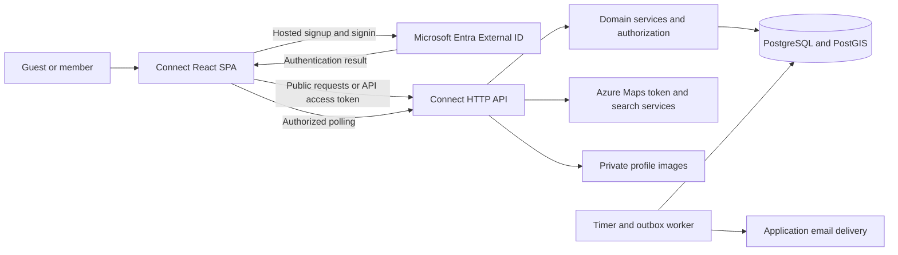
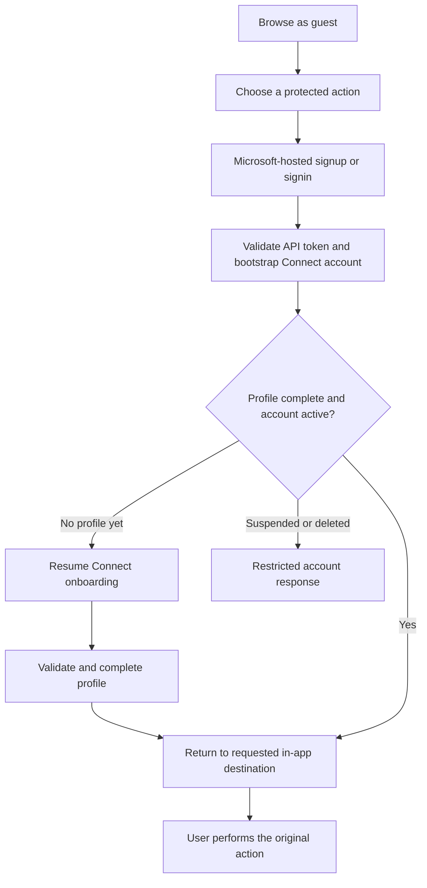
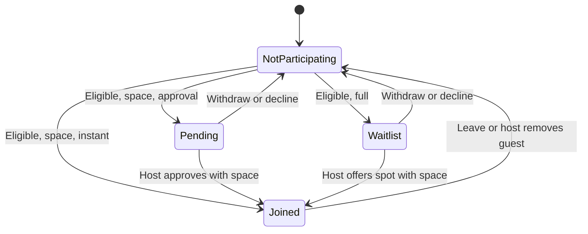

# Connect: flow-driven application and backend architecture

> Find Your People.

## 1. Purpose and status

This document defines a production architecture from the flows implemented in
the current Connect frontend. It is a standalone design, not an amendment to
`Architecture.md`.

**Implemented today:** a React/TypeScript SPA with local fixture data,
session-scoped Zustand state, interactive forms, and optional Azure Maps service
contracts. There is no implemented application backend, database, or real
authentication integration in this repository.

**Confirmed authentication decision:** Microsoft-hosted **Entra External ID**
signup/signin, followed by Connect's own profile onboarding. Connect retains
birth date, gender, interests, location, photo, and privacy preferences in its
application database. It does not own passwords.

The current domain name is **Connect** (`Connect`, `connectId`, `connects`).
This document uses matching names for proposed API resources and database
tables; "gathering" in explanatory prose describes the same product entity.

The services, database entities, and application endpoints below are the
**proposed backend**, unless explicitly identified as existing. They support
observable frontend behavior; they do not turn fixture badges, simulated loading,
or local mutations into claims of working production services.

### 1.1 Product boundary

The application loop is:

**Browse -> authenticate when needed -> complete a profile -> join or host ->
coordinate in a group -> meet -> review past activity.**

In scope are discovery, profiles, hosting and editing, attendance approval,
waitlists, link sharing, group chat, alerts, calendar downloads, ratings,
reporting, and blocking.

Not implied by the current frontend are payment processing, delivered invitation
campaigns, calendar synchronization, direct messaging, automatic waitlist
promotion, verified physical attendance, or an AI recommendation system.

### 1.2 Frontend sources that drive the design

| Surface | Implementation reference | Backend responsibility |
| --- | --- | --- |
| Routes and access gates | `src\App.tsx`, `src\components\Shell.tsx` | Identity, onboarding state, and resource authorization |
| Signup and profiles | `src\features\identity\SignupPage.tsx`, `ProfilePage.tsx`, `identity.ts` | Profile validation, uniqueness, privacy, preferences, media |
| Discovery and detail | `src\features\discovery\DiscoverPage.tsx`, `DetailPage.tsx`, `sortConnects.ts` | Filtered queries and viewer-specific Connect projections |
| Hosting | `src\features\hosting\HostPage.tsx`, `hostSchema.ts`, `hostTime.ts` | Drafts, publication, editing, time and place invariants |
| Host management | `src\features\hosting\ManagePage.tsx`, `hostingActions.ts` | Approval, waitlist admission, guest removal, cancellation |
| Shared domain state | `src\lib\types.ts`, `src\lib\store.ts` | Durable records, transactional commands, authoritative rules |
| My Connects and feedback | `src\features\community\MyConnectsPage.tsx`, `feedback.ts` | Personal activity projections and eligible feedback |
| Chat and alerts | `src\features\community\ChatPage.tsx`, `AlertsPage.tsx` | Authorized message history, messaging, per-recipient alerts |
| Calendar and meeting details | `src\features\community\calendar.ts`, `place.ts` | Permission-filtered source data, not a calendar integration |
| Maps and place search | `src\components\MapView.tsx`, `LocationPicker.tsx`, `src\lib\api.ts` | Maps tokens, search, and validated location data |

## 2. System shape

Use a **modular monolith**: one versioned application API, one relational
database, and background processing from the same backend codebase. Hosting,
participation, privacy, and alerts share transactions; separate microservices
would make those existing flows harder to implement correctly.

### 2.1 Recommended deployment

| Component | Proposed technology | Reason derived from the frontend |
| --- | --- | --- |
| Web application | Existing React, TypeScript, Vite SPA on Azure Static Web Apps | Independently addressable client routes; no server-rendering requirement |
| Application API | Node.js/TypeScript Azure Functions, v4 programming model, HTTP triggers | Bounded queries and commands; shared language and Zod contracts |
| Background processing | Timer-triggered worker in the backend Function app | Durable reminder and notification work must survive closed browsers |
| Transactional data | Azure Database for PostgreSQL Flexible Server with PostGIS | Membership uniqueness, capacity transactions, spatial filtering, relational profiles |
| Database access | `pg`, explicit repositories, versioned SQL migrations | Transactions need a single acquired connection and visible lock boundaries |
| Authentication | Microsoft Entra External ID customer tenant | Approved Microsoft-hosted signup/signin |
| Maps | Azure Maps Web SDK and server-side search/token integration | Existing map and location-picker contracts |
| Profile images | Private Azure Blob Storage with controlled application reads | Existing optional image upload, without database data URLs |
| Application email | Azure Communication Services Email | Existing notification preferences, with actual delivery handled asynchronously |
| Operations | Application Insights, managed identities, Key Vault where necessary | Trace API/worker failures without embedding credentials or private content |

A standalone Functions origin preserves the existing `VITE_API_BASE_URL`
contract. Do not assume a Static Web Apps API proxy. Flex Consumption is a
candidate hosting plan; confirm regional networking support and cold-start,
latency, and capacity requirements before provisioning it.

Chat initially uses authenticated HTTP polling, not a separate real-time
service. This supports the implemented send/history/thread screens without
introducing presence, typing indicators, or WebSocket infrastructure.



The SPA never connects directly to PostgreSQL. Customer identities never
receive infrastructure RBAC or database roles.

### 2.2 Module boundaries

| Module | Owns |
| --- | --- |
| Identity and profiles | Identity mapping, onboarding, profiles, contact sharing, preferences, avatars |
| Catalog and discovery | Fixed taxonomy, category counts, filtering, ordering, map-safe results |
| Connects | Drafts, publication, edits, visibility, locations, cancellation |
| Participation | Joining, pending requests, waitlists, leaving, approvals, removals |
| Community | Message history, sending, My Connects, ratings and attendance feedback |
| Notifications | Alert inbox, read state, recipient selection, email/reminder work |
| Safety | Block relationships, reports, account restrictions, audit events |
| Provider adapters | Entra token validation, Azure Maps, Blob Storage, email |

Modules call shared domain services rather than duplicating permission logic in
HTTP handlers. A UI-disabled button is never the implementation of a rule.

## 3. Authentication and Connect onboarding

### 3.1 Separate identity from the application profile

Entra answers **who authenticated**. Connect answers **who the member is within
this application, what they share, and what they can do**.

| Entra owns | Connect owns |
| --- | --- |
| Credentials and credential policy | Application account ID and status |
| Signup, signin, recovery, configured MFA | Name, immutable username, bio, avatar |
| Configured email or federated signin methods | Birth date and withholding choice; derived age; gender |
| Identity-provider verification | Interests, profile location, discovery radius |
| Authentication tokens and provider session | Contact email/phone, independent sharing consent, notification preferences |

Microsoft-hosted does not require Microsoft-account-only signin. Configure the
customer user flow with the supported methods the product chooses. The current
Google/Apple buttons are not evidence that those providers are configured.

Use the Microsoft authentication libraries for the React SPA and authorization
code flow with PKCE. Register the SPA and the Connect API, expose the API's
delegated scope, and configure exact development/production redirect URIs.
There is no client secret in the SPA, implicit grant, password grant, custom
Connect token issuer, or application password endpoint.

This design deliberately does **not** use Entra native authentication or a
credential-forwarding proxy. The Connect email/password and recovery forms
become entry points to the Microsoft-hosted experience.

### 3.2 Identity-to-account mapping

After provider authentication, the SPA obtains an **access token for the Connect
API** and calls `POST /api/v1/me/bootstrap`.

The API validates signature, trusted issuer, intended audience, lifetime, and
required delegated scope using provider metadata and supported JWT validation.
It must reject an ID token or a Microsoft Graph token presented as a Connect
API credential.

Map the validated `(issuer, subject)` identity to a stable, server-generated
application account ID under a unique database constraint. Bootstrap is
idempotent: concurrent calls cannot create two profiles for one identity.
Email, display name, and browser-supplied user IDs are not identity keys.

Return account status, onboarding status, and the permitted own-profile
projection. Do not silently link separately authenticated accounts by matching
their email addresses.

### 3.3 Onboarding after authentication

The existing seven-stage signup becomes six Connect-owned stages after the
provider completes authentication:

| Stage | Retained frontend information |
| --- | --- |
| 1. Name and username | Display name and unique Connect username |
| 2. Personal details | Contact email, optional birth date, withholding choice, gender, optional phone, sharing controls |
| 3. Photo | Optional profile image |
| 4. Interests | At least two categories for initial onboarding |
| 5. Location and preferences | Optional neighborhood/city and default radius |
| 6. Review and complete | Public-profile preview, then continue browsing or hosting |

Remove the Connect-owned password stage. Prefill contact email from provider
data when available, but do not assume every identity has an email claim or
that an arbitrary email claim proves a notification address is verified.
Retain the valid-contact-email requirement in Connect's personal-details
stage, including an editable input when a provider supplies no usable value.

Save onboarding progress separately from a completed profile. Validate a
partial stage when saving it and the complete profile when finishing.
Authenticated users with incomplete onboarding may resume it or browse public
content; they cannot publish, join, chat, report, or rate until onboarding is
complete. Enforce this in the API, not only through route navigation.



Carry a validated same-origin `returnTo` through authentication and onboarding.
Reject external, protocol-relative, malformed, or authentication-loop targets.
The SDK owns OAuth state/nonce handling; `returnTo` is not a substitute for it.
Returning to a gathering does not automatically join it or bypass its current
eligibility and capacity rules.

### 3.4 Sessions and account changes

Keep authentication state under MSAL, separate from persisted application
state. Prefer an in-memory token cache; let the SDK handle renewal and
interaction-required responses rather than copying tokens into Zustand.

On signout or account change, clear authenticated query results, chat history,
profile data, sensitive form state, and user-scoped local drafts. An expired
token must not leave protected content available through stale application
caches. Provider signout and local cleanup are both required.

Profile contact email is distinct from the Entra signin identifier. Editing it
does not change login credentials. Reset its sharing consent on change, and
require verification before using a new address for application email. The
contact-verification UX is additional integration work; do not invent a
successful verification state in the existing form.

## 4. Frontend boundaries and routes

Retain React Router, CSS Modules, React Hook Form, Zod, the shared components,
centralized copy modules, and lazy-loaded feature screens. Preserve the
Connect visual language, nine-category colors, and existing layout/theme
controls.

Replace the local profile-presence gate with an authentication/onboarding gate.
Backend permissions remain authoritative regardless of the route.

| Route | Intended access |
| --- | --- |
| `/`, `/discover`, `/categories`, `/connect/:id` | Public, with a guest-safe projection |
| `/signup` | Entra entry when signed out; Connect onboarding when authenticated |
| Authentication callback route | New SDK integration route; not currently implemented |
| `/host`, `/connect/:id/edit`, `/connect/:id/manage` | Completed active profile; editing/management additionally require host ownership |
| `/mine`, `/chats`, `/chats/:id`, `/alerts` | Completed active profile and resource-specific permissions |
| `/profile`, `/profile/:id` | Completed active profile; only the owner can edit |
| `/kit` | Existing public component sheet; no special backend privileges |

The hidden preview toolbar remains a presentation aid, not an administrative
interface. My Connects' simulated Loaded/Loading/Empty/Error states and
Discover's timed reload animation must become actual request states in the
connected application.

Use a typed API boundary with shared Zod contracts. Keep editable UI state in
Zustand where useful, but do not treat persisted gathering arrays, locally
computed permissions, or fixture profiles as server truth. On a successful
command, apply the returned authoritative projection and invalidate affected
detail, discovery, My Connects, thread, and alert queries.

Public and authenticated requests may share routes but must not share
personalized response caches. Use `Cache-Control: no-store` for sensitive
profile, location, chat, and account responses.

## 5. Domain and persistence model

Database records are not serialized versions of the current Zustand store.
Normalize identities, memberships, locations, and messages, then construct the
DTOs each screen needs.

### 5.1 Core entities

| Entity | Important data and constraints |
| --- | --- |
| `accounts` | UUID, account status, onboarding status, timestamps; no passwords |
| `external_identities` | Account FK, trusted issuer and subject, unique identity pair |
| `onboarding_drafts` | Account owner, partial profile values, current stage, version |
| `profiles` | Account FK, normalized unique username, name, bio, contact details and email-verification state, birth date, withholding flag, gender, sharing flags, avatar reference, version |
| `member_preferences` | Default radius and email/reminder/message preferences; separate from profile sharing |
| `categories`, `subcategories` | Stable keys, configured parent-child relationships |
| `profile_interests` | Unique account/category pairs |
| `connects` | Host, category, authored text, start/end instants, IANA timezone, capacity, join policy, visibility, roster privacy, skill, eligibility rule, cost, lifecycle status, version |
| `connect_subcategories` | Unique Connect/subcategory pairs; enforce matching parent category |
| `connect_locations` | Location type, public area/point, separate exact venue/point, meeting instructions, online/undecided notes, privacy |
| `hosting_drafts` | Owner and slot (`new` or an owned gathering ID), values, stage, furthest stage, base gathering version, draft version |
| `participations` | Unique gathering/account pair; active state `joined`, `pending`, or `waitlist`; request note and ordering timestamps/sequence |
| `participation_events` | Audit of requests, decisions, leaves, removals, and cancellations without creating a permanent declined-member ban |
| `messages` | Gathering, author account, text, server timestamp, monotonic ordering key |
| `connect_feedback` | Unique Connect/rater pair, host rating, optional attendance feedback, timestamps |
| `alerts` | Recipient, kind, referenced gathering/event, safe content references, read timestamp, creation time |
| `blocks` | Unique blocker/blocked pair; prohibit self-blocking |
| `reports` | Reporter, target kind/ID, reason, details, operational status, timestamps |
| `media` | Owner, blob reference, validated type/size, processing state |
| `outbox`, `notification_jobs` | Durable event/delivery work, recipient, entity version, scheduling, lease and retry state |
| `idempotency_records`, `audit_events` | Command deduplication and protected operational history |

Use foreign keys, uniqueness constraints, check constraints, and transaction
rules together. No API accepts writable rating totals, host identity,
verification badges, or attendance arrays from a caller.

### 5.2 Catalog

Taxonomy is configured, not created by members.

| Category | Subcategories |
| --- | --- |
| Sports | Football/Soccer, Basketball, Volleyball, Tennis/Padel, Running, Cycling, Swimming, Climbing, Other |
| Gaming | PC, Console, Board games, Tabletop RPG, Card games, Arcade/LAN, Other |
| Social | Movie night, Bar crawl, House party, Karaoke, Dinner/Potluck, Coffee meetup, Other |
| Outdoors | Hiking, Beach, Picnic, Camping, Dog walk, Other |
| Arts & Culture | Live music, Museums, Theater, Photography walk, Crafts, Other |
| Learn & Make | Language exchange, Study group, Coding/Hack night, Workshops, Book club, Other |
| Wellness | Yoga, Gym session, Meditation, Group walk, Other |
| Family & Kids | Playground meetup, Kids' sports, Family outing, Other |
| Other | Anything else |

A gathering has one parent category and at least one distinct subcategory
belonging to that parent. Changing the parent clears invalid subcategory
selections. Choosing an Other activity requires its own description, not a new
taxonomy row.

Use stable enum/option keys in API and database contracts, with labels supplied
by `src\copies`. Do not parse localized strings such as "Over 18" to make
authorization decisions. Map the current display-valued form options through
an explicit frontend adapter.

### 5.3 Temporal, eligibility, and monetary values

Store start/end as UTC instants (`timestamptz`) plus the intended IANA timezone.
Store date of birth as a calendar date, not an instant or an aging integer.
Reject invalid supplied dates and derive age at the decision time under a
documented calendar policy.

Represent age constraints structurally, with optional inclusive minimum and
maximum ages. A separate optional gender requirement supports existing
women-only fixtures. The current discovery/hosting UI does not expose general
gender-filter or gender-rule creation; do not imply that it does.

Cost modes are `free`, `split`, `own`, and `ticketed`. The current currency is
ILS. Store amounts as integer minor units with a currency code. Split cost is
a total shared across confirmed attendees, including the host; ticketed cost
is per person. Preserve the UI's clearly estimated, rounded split display.
Free and pay-your-own have no entered amount. There is no payment, checkout,
refund, or ticket-issuance subsystem.

### 5.4 Current frontend contract mapping

Follow the refactored field names rather than restoring the older abbreviated
model. Where production needs a different shape, make the conversion explicit:

| Current frontend field | Production boundary |
| --- | --- |
| `categoryKey`, `subcategoryNames` | Stable category/subcategory keys in writes; localized names in display projections |
| `timeZone`, `startsAt`, `endsAt` | IANA timezone and validated UTC instants |
| `locationType` | `physical`, `online`, or `undecided`; no legacy `tbd` value |
| `latitude`, `longitude`, `distanceKilometers` | Public discovery coordinates/distance; separate authorized exact-point detail |
| `publicAreaLabel`, `venueName`, `meetingInstructions`, `meetingNotes` | Distinct public and protected location fields |
| `isGuestListPrivate`, `joinRequests`, `waitlist` | Policy-aware summaries; names only in permitted projections |
| `costType`, `costAmount` | Cost-type key and an explicit adapter to integer minor-unit amounts |
| `phoneNumber`, `biography`, `avatarDataUrl` | Retain contact/bio semantics; replace the local data URL with an authorized media reference |
| `attendanceRate`, `hostAttendanceRate`, `isVerified`, `isHostVerified` | Server-supported values only; unavailable/unverified until evidence and policy exist |
| `hostedConnectCount`, `connectId`, `isRead`, `isPinned` | Consistent Connect references and explicit boolean/count names |

## 6. Profiles, privacy, and images

### 6.1 Profile rules

Preserve the current name/username/contact validation, optional bio and
location, avatar choices, and 1-100 km default radius. Initial onboarding
requires at least two interests; later profile editing may change or remove
interests as the current editor permits.

Username is unique, normalized case-insensitively, and read-only after
onboarding. The database resolves concurrent claims to the same username.
Name edits update future projections of the member rather than requiring
rewrites of copied host/attendee names in every gathering.

Email, phone, gender, and age each have independent, initially disabled public
sharing. Changing an email/phone value resets that value's consent. Removing a
phone disables phone sharing. Withholding or removing birth date disables age
sharing.

`birthDateWithheld` preserves the owner's entered date but excludes it from
eligibility and public age computation until reversed. Other members never
receive the date of birth. Missing or withheld dates block age-restricted
joining, not ordinary browsing or account creation.

Return separate own-profile and member-profile DTOs. The own-profile response
contains editable private fields; the member projection contains only allowed
fields and visible activity. Public-profile preview uses that same projection,
not a client-side attempt to hide private fields.

The implemented host request view needs identity, a request note, and the
eligibility outcome. It does not require revealing an applicant's undisclosed
gender or date of birth. Do not add an implicit demographic-sharing exception.

### 6.2 Profile activity and badges

Other members' activity excludes link-only gatherings and private-roster
participation, except that hosting a publicly listed gathering is public.
The owner can see their own eligible private activity. Cancelled gatherings
stay in My Connects history rather than appearing as active profile activity.

Host ratings may be aggregated from eligible submitted host ratings; the
account cannot write the aggregate. Define hosted-count semantics consistently
from completed, non-cancelled hosting records. Return unavailable values when
there is no supporting data.

The current reliability percentages and verification badges are fixture
values, not established scoring or verification systems. A successful Entra
signin does not verify physical identity or attendance. Group-level
"someone was a no-show" feedback cannot determine which person missed a
gathering. Do not fabricate per-person reliability or award a verified badge
from those inputs.

### 6.3 Avatars

Support the current PNG, JPEG, GIF, and WebP formats up to 1 MiB. The server
must enforce size, signature/type agreement, successful decoding, and safe
pixel/decompression limits independently of browser validation.

Store processed images in private Blob Storage, remove unnecessary metadata,
and serve only media references/read routes permitted by profile projection.
Do not store base64 images in profile rows, accept arbitrary remote image URLs,
or expose upload credentials. Ownership checks govern replacement and removal;
clean up abandoned uploads and superseded media according to retention policy.

## 7. Discovery, Maps, and location privacy

### 7.1 Discovery query

The server applies visibility and viewer policy before filtering, counting,
ordering, or pagination. Discover includes only published, non-ended,
Everyone-visible gatherings, excluding blocked relationships for authenticated
viewers. Category counts use the same visibility rules and their declared
filter scope; do not count hidden gatherings.

Support the existing query inputs:

| Input | Behavior |
| --- | --- |
| `q` | Search title, host name, public area, category, and subcategory |
| `category`, `subcategory` | Multiple parent categories; subcategory must belong to a selected parent |
| `radius` | 1-100 km, defaulting to the saved member preference where available |
| Search center | Manual place selection held in client memory; a public area fallback when not selected |
| `when` | Any time, today, tomorrow, this week |
| `level`, `age`, `cost` | Existing skill, age-group, and cost-mode options |
| `spots` | Exclude full capacity-limited gatherings when enabled |
| `sort` | Distance, relevance, popularity |

Today/tomorrow filters use interval overlap, so ongoing gatherings are not
discarded simply because they started earlier. Pass an explicit search
timezone to preserve the current browser-calendar interpretation; do not use
the server machine's local timezone.

Distance ordering uses the public discovery point, with no-distance results
after located results. Relevance follows existing text-match/interests
weighting, not an AI model. Popularity uses confirmed attendance. Break ties
by start time, then Connect ID, matching `sortConnects.ts`.

Use PostGIS geography and a spatial index for radius filtering, with supporting
indexes for published/time/category and membership queries. Apply the complete
filter set before keyset pagination. Bind cursors to the query, sort, search
context, and viewer; cap page sizes. Mutable popularity and edits can reorder
results between requests, so cursor pagination is not a frozen snapshot.
Deduplicate on the client and restart the query on refresh or context changes.

List and map consume the same filtered result set. Page them together rather
than independently querying a differently filtered map. A future
viewport/cluster endpoint is not required by the current UI.

### 7.2 Physical, online, and undecided places

| Mode | Coordinates | Meeting details |
| --- | --- | --- |
| Physical | Confirmed exact point; public point equal to it or generalized | Venue and optional meeting instructions |
| Online | None | Optional meeting link/instructions |
| To be decided | None | Optional plans for choosing a meeting place |

Online/TBD gatherings have no fabricated distance or marker and are not
excluded solely because they have no physical radius match. Switching place
modes clears incompatible location fields. Selecting Online initially enables
private meeting details as in the wizard; subsequent visibility still follows
the explicit privacy control.

Persist exact and public location data separately. For a private physical
place, require a host-authored public neighborhood/area and derive a
generalized discovery point. Use that point for public coordinates, radius
matches, ordering, and distance labels, preventing indirect exact-location
disclosure through search results.

The current preview rounds the sole stored coordinate pair. Production must
not copy that lossy model: retain the exact point separately so authorized
attendees receive the correct meeting point and switching privacy does not
destroy the original location.

### 7.3 Viewer-specific disclosure

| Viewer | Private meeting details | Private roster names |
| --- | --- | --- |
| Guest or unrelated member | Hidden | Hidden |
| Pending or waitlisted member | Hidden | Hidden |
| Confirmed attendee | Visible | Hidden |
| Host | Visible | Visible |

Public meeting details are visible to anyone permitted to open the gathering.
A public roster exposes the confirmed roster, not pending requests or
waitlists. Counts and current-user attendance can be returned without exposing
other members' identities.

Apply these rules to cards, avatar stacks and accessible labels, details, map
markers, profile activity, chat previews, alerts, and calendar source data.
The current card/avatar exceptions are implementation gaps, not permission
rules. Hidden values must be absent from unauthorized API responses.

Link-only is an **unlisted URL**, not an access-control list or invitation
token. Anyone with the link can open its permitted public projection and
request/join under normal rules. Exclude it from discovery and other members'
public activity. Do not describe sharing the link as granting confirmed access.

### 7.4 Existing Maps integration contract

Keep these existing frontend contracts:

| Route | Response |
| --- | --- |
| `GET /api/v1/maps/token` | `{ "token": "<short-lived Maps token>" }` |
| `GET /api/v1/locations/search?q=...` | `{ "results": [{ "label": "...", "latitude": 32.1, "longitude": 34.8 }] }` |

Location search needs `VITE_API_BASE_URL`. Map rendering additionally needs the
public `VITE_AZURE_MAPS_CLIENT_ID`. The Maps SDK obtains a short-lived token
through its existing callback; no subscription key or client secret belongs
in `VITE_*` configuration.

Guest map/search access is deliberately supported. Rate-limit and bound these
public provider-proxy routes independently of member authentication. Use a
narrowly privileged Maps identity, explicit CORS, provider timeouts, and
`Cache-Control: no-store` for tokens. Search is debounced/cancellable in the
client; preserve retry and unavailable states and keep list discovery usable.

Selected search coordinates must not enter frontend URLs, share links, or
telemetry. Send discovery coordinates in a request body, not its URL.
Signup's geolocation action currently only acknowledges permission; it does
not geocode a profile location or set a persistent search center.

Known venue fixtures are a demo fallback, not production geocoding. Respect
Azure Maps attribution and provider-data retention terms, and distinguish
provider-derived labels from host-authored public areas and instructions.

## 8. Hosting, editing, and drafts

### 8.1 Wizard

Preserve the eight hosting stages:

**Category -> subcategories -> words -> when -> where -> rules -> details ->
review**, followed by publication/save confirmation.

Title is required; description and what-to-bring are optional. Other activity
details are required only when the selected taxonomy calls for them. Capacity
includes the host and may be unlimited. The host is inserted as a confirmed
participant in the publication transaction.

Preserve the wizard's current validation bounds, including title length,
optional text limits, valid parent/subcategory combinations, positive
split/ticketed amounts, and confirmed physical pins.

For a scheduled gathering, validate local date/time and IANA timezone and
resolve the selected instant server-side. Reject nonexistent daylight-saving
times; require first/second occurrence only for repeated local times. Do not
accept an arbitrary client-supplied UTC offset as proof of a valid time.

For Happening now, assign the start using server time at publication. An end
is always required, later than start and still in the future. Editing an
ongoing gathering preserves its unchanged original start; it must not restart
the gathering simply because the edit was submitted later.

### 8.2 Draft lifecycle

Maintain one `new` draft slot per member and one edit-draft slot per owned
gathering, matching the current wizard keys rather than inventing a
multi-draft management screen.

Save and close explicitly persists values, current stage, furthest visited
stage, and version. Draft validation permits incomplete forms but rejects
malformed/oversized data and unauthorized ownership. A saved draft is private,
not a gathering, and never appears in discovery or reserves attendance.

Reopening restores the draft; discarding removes it and resets defaults.
Publication/editing validates the complete payload. If a saved draft is
involved, check its version and clear only that version in the successful
transaction. Never delete another tab's newer draft.

An edit draft records the gathering version it was based on. If host controls
or another tab changed the gathering, surface a conflict for review instead of
overwriting newer settings. The current frontend uses version-2 storage keys
and no longer migrates legacy offset-valued drafts. Version future server-draft
schemas explicitly; do not automatically import client-owned production data.

### 8.3 Management

Only the host may edit details, toggle rules, inspect requests/waitlists,
approve/decline, remove a confirmed guest, or cancel. The host cannot remove
themselves or leave their own gathering.

Private meeting details force approval and disable instant joining. Turning
privacy off makes instant joining available but does not automatically switch
an approval gathering to instant. Enabling physical-place privacy requires a
public area; the original venue address must not become the public label.

Capacity cannot be lowered below confirmed attendance. Increasing capacity
does not automatically promote waiting members. Changing eligibility rules
does not silently evict confirmed attendees; apply the new rules to subsequent
join/admission decisions.

Ended/cancelled gatherings are not editable and cannot accept new
participants. Cancellation preserves confirmed attendance and history, clears
pending/waitlist entries, records an optional reason, and creates notification
work. Ending is derived from the stored end time; it does not depend on a
browser timer or require a worker to mark a row ended.

## 9. Participation state and transactions

### 9.1 State transitions

Eligibility requires a completed active profile, an available gathering, no
disqualifying block relationship, and matching configured age/gender rules.
Skill level is a descriptive filter; the current frontend does not maintain
member skill credentials for eligibility enforcement.

| Command | Preconditions | Result |
| --- | --- | --- |
| Join with space, instant policy | Eligible, no active participation | `joined` |
| Join with space, approval policy | Eligible, no active participation | `pending`, optional note |
| Join when full | Eligible, no active participation | `waitlist`, regardless of join policy |
| Repeat join | Already on a list | Return existing state; do not duplicate |
| Approve pending request | Host, still eligible, capacity available | `joined` |
| Offer waitlist spot | Host, still eligible, capacity available | Immediately `joined`; no later acceptance stage |
| Decline request/waitlist entry | Host, active gathering | Remove active entry; keep an audit event |
| Leave or withdraw | Member owns participation, active gathering, not host | Remove active entry |
| Remove confirmed guest | Host, active gathering, target is not host | Remove attendance and its protected access |
| Cancel | Host, active gathering | Preserve confirmed history; clear pending/waitlist |
| Reach end time | Time predicate | Freeze changes and message sending; preserve historical list state |



All diagram transitions are subject to the gathering's active lifecycle.
Account restrictions and safety-related access revocation still apply to
historical gatherings; freezing ordinary participation changes does not freeze
authorization.
Decline/removal is not a permanent ban; joining again is allowed if current
rules permit it. There is no automatic FIFO promotion, timed offer, reservation,
or overbooking grace period. Waitlist order supports the displayed position,
not a promise that the host must admit the next person.

### 9.2 Transaction protocol

For every attendance-affecting command:

1. Authenticate and resolve the actor; never trust `hostId` or acting-member IDs in the request body.
2. Acquire a database connection and begin a transaction.
3. Acquire required account/policy locks in a consistent order, then lock affected gathering rows in ID order.
4. Reload account status, blocks, current participation, capacity, lifecycle, and eligibility using server time.
5. Apply the change, audit event, recipient alerts, and durable outbox work atomically.
6. Commit, then return the current viewer-safe projection.

Use row locks such as `SELECT ... FOR UPDATE` on the same acquired connection.
Joining, approving, removing, cancelling, publishing, and capacity changes must
share this protocol; checking a count before the transaction is insufficient.
The unique participation constraint is additional protection, not a
replacement for serializing capacity decisions.

Profile eligibility changes and blocking use the same account/policy locking
discipline. A block locks the relevant account pair before affected gathering
rows, so a concurrent join cannot commit based on a stale no-block check.
Recheck eligibility during approval, not only when the original request was
created.

Use bounded transaction timeouts and consistent lock ordering. External
provider calls and email sending must not occur while holding these locks.

### 9.3 Versions and retries

Use optimistic versions/ETags for profile edits, gathering edits, drafts, and
preferences. Return a conflict rather than silently accepting stale edits.

Use actor-scoped idempotency keys for publication, joining, decisions, message
sending, reports, and other retryable creation commands. Bind each key to its
operation, target, and request hash. Save the idempotency result in the same
transaction; reject reuse with a different payload.

Reauthorize retries and reconstruct their permitted response. A stored
idempotency response must not replay an exact address or chat payload after
membership was revoked.

## 10. My Connects, sharing, and calendar

### 10.1 Personal activity groups

| Tab | Server query |
| --- | --- |
| Hosting | Active published gatherings owned by the member |
| Joined | Active published gatherings the member joined, excluding their own hosting |
| Invites | Active pending requests and waitlist entries |
| Past | Related ended or cancelled gatherings retained by hosting/participation state |

Sort active groups by start ascending and Past by start descending.
Pending/waitlist entries that reach their end time appear as closed requests,
not attended events. Cancellation clears those entries, matching the current
store behavior; it does not fabricate attendance history for them.

Tab counts and lists must use the same authorization and grouping rules.
Return eligibility for rate/chat/edit actions from the API rather than
inferring it from the tab name alone.

### 10.2 Invitations and sharing

Invite friends and Share link copy the gathering URL. There is no invitation
record, recipient acceptance workflow, contact import, or invitation email
service implied by these buttons.

The Invites tab's current name does not change its pending/waitlist semantics.
Durable gathering records make newly shared links resolvable across browsers;
the current session-only fixture implementation cannot provide that.

### 10.3 Calendar export

Keep client-side `.ics` generation using the existing calendar helper and
authorized DTOs. Use UTC start/end instants, stable gathering UID, escaping,
line folding, and the appropriate cancellation status. Export private meeting
details only when the current viewer is entitled to receive them.

Add to calendar downloads a file. It does not request Microsoft Graph calendar
permissions, synchronize later edits, subscribe to updates, or remove events
from someone else's calendar. Explain that copies already exported cannot be
revoked when a member later leaves or is blocked.

## 11. Group chat, alerts, and feedback

### 11.1 Group chat

One logical conversation belongs to each gathering. Pending/waitlisted
members can see a locked thread shell but not messages, private pinned
details, or message snippets. Only confirmed attendees, including the host,
can read messages. Ended/cancelled conversations remain readable to retained
confirmed participants but reject new messages.

Validate text after trimming: 1-2,000 characters. Assign author identity,
timestamp, message ID, and ordering sequence on the server. A client message ID
or idempotency key prevents duplicates after a network retry; it does not let
the client choose another author.

Return paginated history and poll for messages after the last sequence while
the conversation is active in the UI. Back off on errors/rate limits, pause
background-tab polling, and refresh permissions on focus. On access loss,
clear visible history and snippets; every read/send request is reauthorized.

Render plain text safely. Pinned meeting details derive from the latest
authorized gathering data. Fixture messages marked pinned are presentation
examples; there is no implemented user-facing pin/unpin or message-editing
workflow to design as a new feature.

### 11.2 Alerts and notification preferences

Alerts are per-recipient database records, not one browser-global array.
Support All/Unread, unread count, mark one/all read, and descending creation
order.

Preserve destination behavior: host request alerts go to management; message
alerts open chat only when the viewer still has access; other events open the
gathering or a safe unavailable state. Never expose a private message body
through an alert after chat access is revoked.

| Event | Intended recipients |
| --- | --- |
| Join/request/waitlist | Acting member's result; host updates where action is needed |
| Approval/decline/removal | Affected member |
| Material gathering edit/cancellation | Affected participants under current access policy |
| New message | Other confirmed participants, without unauthorized message previews |
| Scheduled reminder | Still-confirmed participants of the still-active gathering |

Notification preference is not profile-sharing consent. A private contact
email may receive application notifications if verified and permitted by the
email preference. Disabling reminders/messages disables that optional
notification category, not access to the gathering or conversation. Keep
essential in-app command/participation results available; apply category
preferences to optional alerts and delivery jobs consistently.

The current frontend only saves preferences and displays fixture/local alerts.
The exact reminder lead time, frequency, and essential-email policy are launch
configuration decisions, not timing guarantees already implemented.

### 11.3 Reliable background work

Write domain events/outbox work and immediate in-app results in the originating
transaction. A worker claims due work using leases and `FOR UPDATE SKIP LOCKED`,
then commits the claim before contacting a provider.

Delivery is at least once. Deduplicate logical jobs and use provider-supported
idempotency where available; do not promise exactly-once email. Record
attempts, retry transient failures with bounded backoff, and surface exhausted
work for operational handling.

Before delivery, reload the gathering version, event-specific recipient
eligibility, block state, preferences, and verified delivery address. Skip
superseded reminders and reminder/message jobs for cancelled gatherings or
revoked recipients. Cancellation, decline, and removal outcomes instead use
their recorded affected recipients and safe terminal-event summaries; they
must not disappear merely because the event removed active participation.
Never include revoked meeting details or chat content in those summaries.
Schedule/reschedule reminder jobs from persisted start times and versions,
not `setTimeout` in a browser.

Minimize sensitive payloads in jobs and logs. Prefer entity references and
permission-checked rendering at delivery time to copied exact locations,
contact details, or full chat bodies.

### 11.4 Ratings and attendance feedback

Only a confirmed attendee can rate the host of a completed, non-cancelled
gathering hosted by someone else. Permit a 1-5 integer rating and updates to
the member's previous rating under a unique gathering/rater constraint.

Optional attendance feedback is `all` or `no-show`; it is not proof of an
identified person's presence or absence. Keep the reporter's original feedback
separate from any future reliability-scoring system. The frontend's current
host-rating and attendance-feedback storage can become one transactional
feedback command without changing the form.

## 12. Reporting, blocking, and authorization

Reporting saves a report with a target, reason, and optional details. It does
not automatically block anyone, remove a gathering, or imply a moderator has
reviewed it. Provide a restricted operational triage process before launch;
the member UI need not become a moderation console.

Blocking preserves the current host/member relationship behavior: remove the
blocker's participation in gatherings hosted by the blocked member, and
remove the blocked member from gatherings hosted by the blocker. Remove
pending/waitlist relationships as well. Revoke protected details/chat access
where confirmed participation was removed.

Unblocking does not restore prior attendance or requests. Decline, removal,
and block are different operations with different consequences.

Do not silently remove either person from unrelated third-party gatherings
they both attend. The current implementation does not define global
shared-room invisibility or deletion of historical messages; any stronger
block policy needs an explicit product decision.

Centralize policies for account status, onboarding, ownership, participation,
blocks, profile projection, and meeting/roster disclosure. Apply them to list,
detail, search counts, mutation results, exports, alerts, and provider adapters.
Use indistinguishable not-found/unavailable responses where revealing a hidden
resource's existence would disclose information.

Authorization to use Connect is not authorization to manage Azure resources.
Administrative operations require separately authorized operator identities;
customers must not self-assign roles or request moderation privileges through
profile updates.

## 13. API contract

All application routes use `/api/v1`. The Maps routes already exist as client
contracts; the remaining routes below are proposed.

### 13.1 Endpoint groups

| Method and path | Purpose |
| --- | --- |
| `POST /me/bootstrap` | Idempotently resolve/create the application account from the validated Entra identity |
| `GET /me` | Own account, onboarding status, profile, and preferences |
| `PUT /me/onboarding` | Save partial onboarding values and stage with a version |
| `POST /me/onboarding/complete` | Validate and activate a completed profile |
| `PATCH /me/profile` | Edit permitted profile fields and enforce consent resets |
| `PATCH /me/preferences` | Update radius and notification preferences |
| `GET`, `POST`, `DELETE /me/avatar` | Owner-authorized image reads, replacement, and removal, including during onboarding |
| `GET /members/{id}`, `GET /members/{id}/avatar` | Authorized member projection and profile media |
| `GET /catalog` | Stable categories, subcategories, and option keys |
| `POST /connects/search` | Filtered/paginated discovery, with coordinates in the body |
| `GET /categories/counts` | Viewer-filtered active category counts with an explicit query scope |
| `GET /connects/{id}` | Guest/member/host detail projection |
| `GET`, `PUT`, `DELETE /me/hosting-drafts/{slot}` | Resume, explicitly save, or discard a private draft |
| `POST /connects` | Validate and publish, including the host's confirmed participation |
| `PATCH /connects/{id}` | Host editing and management toggles with version checking |
| `POST /connects/{id}/cancel` | Host cancellation with optional reason |
| `POST /connects/{id}/participation` | Join/request/waitlist the authenticated member |
| `DELETE /connects/{id}/participation` | Leave or withdraw the authenticated member |
| `GET /connects/{id}/participants?state=...` | Host-only paginated management lists |
| `POST /connects/{id}/participants/{memberId}/decision` | Host approve/decline a pending or waitlisted member |
| `DELETE /connects/{id}/participants/{memberId}` | Host removes a confirmed non-host guest |
| `GET /me/connects?tab=...` | My Connects tab results and counts |
| `GET /me/threads` | Authorized/locked conversation summaries |
| `GET`, `POST /connects/{id}/messages` | Authorized message pagination and sending |
| `GET /me/alerts` | All/unread alerts, cursor and unread count |
| `POST /me/alerts/{id}/read`, `POST /me/alerts/read-all` | Mark recipient-owned alerts read |
| `PUT /connects/{id}/feedback` | Eligible host rating and optional attendance feedback |
| `POST /reports` | Record a report with validated target/reason |
| `GET /me/blocks`, `PUT`, `DELETE /me/blocks/{memberId}` | List, block, and unblock relationships |
| `GET /maps/token`, `GET /locations/search` | Existing Maps integration contracts |

There are no Connect `/login`, `/password`, payment, invitation-delivery, or
calendar-sync endpoints in this architecture. Profile-contact verification and
account deletion require their own provider/operational contracts before those
additional production flows are enabled.

### 13.2 Request and response rules

Validate all inputs on the server with allowlisted schemas and bounded text,
body, and page sizes. Share contract definitions, not database models, with
the SPA. Keep display-copy ownership in `src\copies`; stable error codes map
to those modules.

An error has a stable shape:

```json
{
  "error": {
    "code": "CAPACITY_FULL",
    "requestId": "<request-id>",
    "fields": {}
  }
}
```

Use 401 for absent/invalid required authentication, 403 for disallowed
operations, 404 for unavailable resources, 409 for version/state conflicts,
422 for validation failures, and 429 with retry guidance for rate limits.
Do not turn provider/database failures into empty successful result sets.

Commands return current state, version, relevant counts, and permitted actions
for their caller. Reconcile from that response rather than incrementing
attendance optimistically and assuming the write succeeded.

No response exposes another member's Entra subject, private profile fields,
hidden roster identities, or unauthorized meeting details. Public read
endpoints with an invalid supplied bearer token must not silently retry as a
guest and confuse authenticated state.

## 14. Operational and implementation boundaries

### 14.1 Deployment and operations

Deploy the SPA and backend independently through one chosen CI/CD platform.
Build infrastructure reproducibly; select the IaC/pipeline tooling when the
deployment work is undertaken rather than infer it from frontend components.

Use private PostgreSQL networking and backend VNet integration, TLS
validation, and managed identities with least-privileged resource/database
roles. Refresh database authentication tokens when acquiring new connections.
Keep migration permissions separate from runtime permissions.

Bound connection pools, request concurrency, worker batch size, and outbound
provider timeouts. Database capacity must remain safe as the Function app
scales out. Prefer one database and the outbox until measured demand justifies
additional infrastructure.

Trace requests through command, transaction, and background delivery IDs.
Monitor failures, latency, lock contention, denied access, outbox age,
notification retry exhaustion, and provider throttling. Exclude tokens,
birth dates, private contacts, precise search coordinates, and message bodies
from logs and analytics.

Require backups and tested restoration, migration rollback/forward recovery,
retention for drafts/messages/reports/media, and an account deletion process.
Define how deletion affects hosted future gatherings and retained participant
history before public launch; authentication-provider deletion alone is not
application data deletion.

### 14.2 Frontend-to-backend replacement

| Current implementation | Connected implementation |
| --- | --- |
| `demoLogin` or locally completed profile | Entra authentication plus server onboarding status |
| `connect-state-v2` Connect/profile arrays | Authorized API queries and durable database records |
| Local store mutation as the final result | Validated transactional command and authoritative response |
| Session-only hosting draft | Owner-scoped explicit server save with optimistic version |
| Data URL avatar | Validated private media reference |
| Local messages and fixture alerts | Authorized message APIs and recipient-specific alert records |
| Separate local rating/attendance stores | Server-validated feedback transaction |
| Rounded sole location point | Distinct public and exact location data |
| Whole gathering object shared across screens | Per-viewer summary/detail/management DTOs |
| Simulated reload/error controls | Real request status, retry, and conflict handling |

Keep fictional data in an explicit demo mode. Do not upload the existing
session store, fictional identities, badge values, reports, or attendance into
production as a migration.

The current fixture source is `src\copies\data\connects.json`. Browser state
uses `connect-state-v2`, hosting uses
`connect-host-draft-v2:<profileId>:<connectId-or-new>`, and attendance feedback
uses `connect-community-feedback-v2`. These are local namespaces, not server
account boundaries or import contracts.

### 14.3 Proposed code organization

The current frontend folders remain in place. Backend/contracts directories
below are proposed, not existing implementation:

```text
src\
  components\
  copies\
  features\
  lib\
    api\                 Auth-aware requests and typed client adapters
    auth\                MSAL integration and onboarding routing

contracts\
  identity\
  connects\
  participation\
  community\

server\
  src\
    functions\           HTTP and timer entry points
    modules\             Domain services and policies
    repositories\        PostgreSQL queries and transactions
    projections\         Viewer-safe DTO construction
    providers\           Entra, Maps, Blob, email adapters
    workers\             Outbox and scheduled notification processing
  migrations\
```

Do not introduce a monorepo framework, message broker, distributed cache,
gateway, or additional auth provider merely to create this folder structure.

### 14.4 Delivery sequence

1. Establish shared contracts, database migrations, authorization policies, and Entra configuration.
2. Connect hosted authentication, account bootstrap, resumable onboarding, profile privacy, and image storage.
3. Connect catalog/discovery, Maps, and viewer-safe gathering details.
4. Connect hosting/drafts/editing and transactional participation, cancellation, and blocking.
5. Connect My Connects, chat, alerts, outbox delivery, feedback, and reporting.
6. Remove production dependence on fixtures and complete operational/privacy release gates.

Each phase must preserve the corresponding existing screen flow. In
particular, exercise concurrent last-spot requests, stale edits, duplicate
submissions, interrupted onboarding, expired tokens, blocked relationships,
private roster/location projections, DST transitions, access-revoked chat,
and stale reminder jobs.

Current repository commands remain `npm ci`, `npm run dev`,
`npm run check:copies`, `npm run build`, and `npm run preview`. The copy checker
is a separate heuristic command; Vite injects centralized document metadata.
No backend build, migrations, automated test runner, deployment pipeline, or
Entra setup is created by this document.

## 15. Decisions still required before launch

These are not reasons to change the approved authentication/onboarding split:

| Decision | Why the frontend cannot answer it |
| --- | --- |
| Entra tenant, domains, signin methods, MFA and recovery policy | Provider buttons currently show unavailable states |
| Minimum age, launch regions, restricted activities, and age-calculation policy | Optional demographic fields do not establish legal eligibility rules |
| Verified badge and individual reliability policy | Existing values are fixtures; group no-show feedback is insufficient |
| Reminder timing and essential/optional delivery policy | Preferences exist, but no durable delivery schedule exists |
| Editable contact-email verification | Profile editing is implemented; verification is not |
| Stronger blocking semantics in third-party group chats | Current blocking only changes reciprocal host/member participation |
| Moderation ownership, response targets, retention, and account deletion | Reports and local block actions are not moderation operations |
| Availability targets, expected scale, region, budget, and recovery objectives | A local frontend cannot determine production capacity or SLA |

## 16. Microsoft identity references

The approved approach uses Microsoft-hosted authentication; native
authentication is not required to retain Connect's own onboarding data.

- [Create customer signup/signin user flows](https://learn.microsoft.com/en-us/entra/external-id/customers/how-to-user-flow-sign-up-sign-in-customers)
- [Choose browser-delegated or native authentication](https://learn.microsoft.com/en-us/entra/external-id/customers/concept-choose-authentication-approach)
- [Access tokens and API validation responsibilities](https://learn.microsoft.com/en-us/entra/identity-platform/access-tokens)
